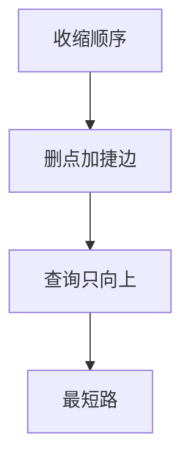

# 收缩层次 CH

按重要性收缩顶点，用捷径补上被删点的最短路角色；查询只向上走，路网规模上比朴素 Dijkstra 快几个数量级。

<footer>—— 据 Geisberger, Sanders, Schultes and Delling, Contraction Hierarchies, 2008 整理</footer>

上一课[双向与 ALT](/cs/bidirectional-alt)用路标造 $h$。收缩层次（CH）把预处理做成**改图**：删点加捷边。不重写三角启发。缺口是收缩顺序与查询的向上搜索。本课路网静态；动态边权下一课换连通性结构，不是 CH 更新全文。

## 问题

给顶点重要性（度、捷边数、层级启发式）。收缩 $v$：对 $v$ 的邻对 $(u,w)$，若 $u$–$v$–$w$ 是唯一或必要最短，加捷边 $u\to w$ 权 $d(u,v)+d(v,w)$（见证搜索判断是否已有不经 $v$ 的更短路）。查询：从 $s$ 与 $t$ 只走向层级更高的邻接（含捷边），双向直到稳定。最短路在「先升后降」的层级上。

缺口是捷边维护最短路，不是 A* 的 $f$。

### 顺序是启发不是定理

差顺序导致捷边爆炸。实践用局部重要性排队。正确性：任意顺序只要捷边补全「经被删点的最短」，查询图仍保留最短路。空间与时间是工程。

Geisberger 等 2008。后续 Customizable CH、PHAST 全源。本课直觉：收缩 + 向上。后课动态连通性是边插删，不是路网权更新的 CH 维护。

## 方法

离线：按序收缩，见证 Dijkstra 决定捷边。在线：双向只走更高层。还原路径时展开捷边为原路径。

与 ALT 可叠加，本课单独 CH 已够。

## 机制

低层点被收缩后，高层仍通过捷边「看见」它们的中转。查询向上：类似最高点当 LCA 式的交会。与 Kruskal 重构树：都是预处理树/层，但 CH 针对最短路而非瓶颈。与 Dijkstra：查询图边少、方向受限。

不要在任意稠密图上期望 CH 奇迹：路网低度和层次结构是前提。

## 边界

本课不写时间窗、不写并行定制化 CH 细节。不进导航产品。后课默认：静态路网最短路预处理首选 CH 一类。下一课动态连通：边插删下维护连通。

## 小结

- 收缩补捷边，查询只向高层。
- 顺序启发决定空间；正确性靠捷边语义。
- 适合稀疏有层次的路网。
- 出处：Geisberger, Sanders, Schultes and Delling, 2008。
