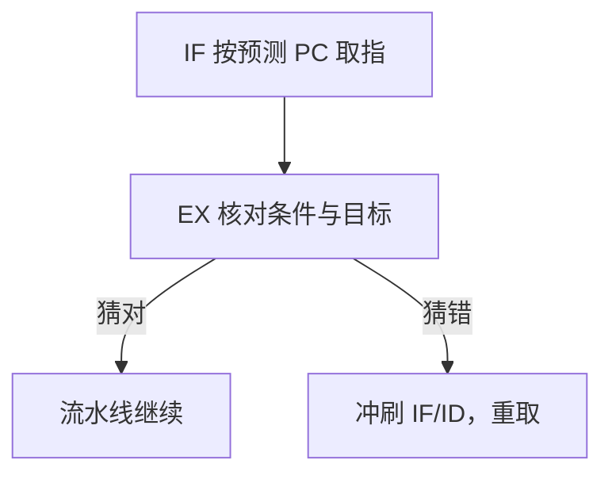

# 控制冒险与分支预测

下一条该取哪一句，往往要等当前这句算出条件；猜错就得把已经取进来的指令丢掉。

<footer>—— 据 Patterson and Hennessy, Computer Organization and Design (RISC-V)；Hennessy and Patterson, CA:AQA 整理</footer>

[上一课](/cs/load-use-stall)用转发保住了 ALU 的 RAW 顺序，load-use 仍可能停一拍。本课不重讲旁路 mux。缺口是：IF 每拍都要一个 PC，而条件分支的方向与目标要到 EX 才齐。取错指令不是数据用错，而是控制流用错。本课只处理控制冒险，并把静态/一位动态预测当作可撤销的猜测。

## 问题

`beq` 在 EX 才知道比较结果和目标地址。若 IF 盲目取 PC+4，分支成功时已经灌进一到两条不该执行的指令。全部停到 EX 再取，CPI 被分支频率打穿。缺口不是再加一条转发，而是**在目标未知时仍要取指，错了再冲刷**。

[调用约定与栈](/cs/calling-convention-stack)里的跳转、返回是无条件控制流，目标往往更早可知；条件分支才是五级里的硬缺口。本课不把间接跳转预测表铺开。

延迟槽是早期 RISC 把冒险交给软件的办法。当代核几乎不用程序员可见的延迟槽，而用预测加冲刷。

## 方法

最简单：假定分支不成功，继续取顺序指令；EX 发现成功则把 IF/ID 作废，从目标重取。代价是成功分支损失两拍（五级里条件在 EX）。把比较前移到 ID 可以少损失一拍，但关键路径变差。

预测：用分支 PC 索引一位饱和计数器，或固定「向后成功、向前失败」。预测成功则按预测地址取指；EX 核对，错则冲刷并更新计数器。本课只钉「猜 + 核对 + 冲刷」，不引入两级自适应或竞赛预测器。

## 机制

冲刷与数据转发不同：转发改的是 mux 数据，冲刷改的是「这些级里的指令当作没发生过」。被冲刷的指令不得写寄存器、不得访存。预测器状态在核对后更新，本身不是 ISA 可见的寄存器。

控制冒险的 CPI 损失 ≈ 分支频率 × 误预测率 × 损失拍数。后课阿姆达尔会把这项与数据停顿、结构停顿加在一起。本课只交出这项的来源。五级里损失拍数由「条件在哪一级才齐」决定，前移比较能减小它，但那是实现交易，不是新的 ISA。

## 边界

本课不处理异常：中断和缺页也会让已取指令作废，但精确异常要另订提交点，见[流水线异常](/cs/pipeline-exception)。也不把预测器做成可被用户态编程的架构状态。特权级下的陷阱与 `eret` 仍走上一课已经钉死的入口，只是流水线要冲刷用户指令。

后课默认：五级核用预测取指，误预测冲刷；正确路径上的 RAW 仍靠转发。

## 小结

- 控制冒险是下一 PC 未知，不是操作数未知。
- 预测让 IF 继续；核对失败则冲刷，不得写回。
- 异常精确性是后课的缺口。
- 延迟槽不进入主干；当代核用预测加冲刷。
- 出处：Patterson and Hennessy, *COD* RISC-V；Hennessy and Patterson, *CA:AQA* 分支预测章。
