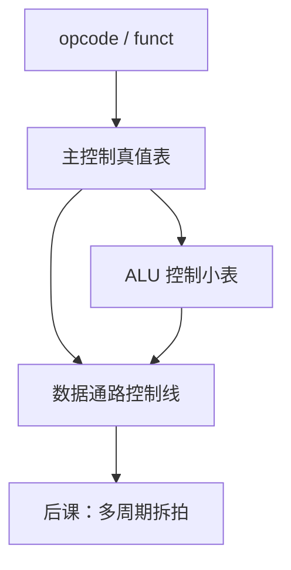

# 控制器真值表

数据通路上每根选择线都是 opcode 的组合函数；把指令类型排成表，综合成门或 ROM。

<footer>—— 据 Patterson and Hennessy, Computer Organization and Design (RISC-V) 整理</footer>

上一课[单周期数据通路](/cs/single-cycle-datapath)把 ALUSrc、RegWrite、MemWrite 等留作端口。本课不重接 ALU 内部，也不从微程序另起。缺口是：**谁根据指令比特驱动这些端口**。答案是组合控制器：真值表。

## 问题

RV32I 每类指令需要一组确定的控制：`lw` 要 MemRead、MemtoReg、ALU 加、RegWrite；`sw` 要 MemWrite、ALU 加、不写堆；`beq` 要分支比较、不写堆；R 型要 ALU 功能来自 `funct`。缺口是把 `opcode`（及 `funct3`/`funct7`）映射到控制向量。ALU 控制可拆成主控给 `ALUOp`，再由第二张小表译 `funct`。

这是组合逻辑，延迟加在取指之后的关键路径上。无关 opcode 若必须 trap，行不能当 $X$。

### 真值表不是 FSM

单周期没有「执行阶段状态」：一拍做完，控制器无现态寄存器。把本课画成多圆圈状态图，会与下一课多周期抢层。分支「是否成立」是数据通路比较结果与控制里 Branch 信号相与，仍是同一拍组合。

Patterson/Hennessy 用两级 ALU 控制减少主表列数。Harris 把控制写成 HDL 的 `case (opcode)`。实现可以是 ROM，内容仍是本课的表。

## 方法

列指令类型 × 控制信号。`ALUOp` 再进 ALU 控制表出「加/减/与/或/slt」。综合成两级门，满足建立。非法 opcode 输出「异常」线，本课可先接地，[异常课](/cs/exception-interrupt-entry)再接。

## 机制

控制延迟与指令存储器输出直接相关：opcode 来得晚，控制就晚，往往不在 `lw` 的内存路径上成为最长，但仍须签核。单周期 CPI 仍为 1，只是 $T$ 含控制。

`jal`/`jalr` 的控制容易漏：RegWrite=1、写回值是 PC+4、ALU 或加法器算目标。表要单独一行。

## 边界

本课不把流水线控制按级寄存。不引入微码地址。CSR 指令的控制后置。

后课默认：单周期控制是 opcode 的组合函数。下一课为缩短 $T$ 把指令拆成多拍，控制变成 FSM。

## 小结

- 控制信号 = 指令类型的真值表（可加 ALU 子表）。
- 单周期控制器无状态。
- 非法编码与 `jal` 回写是表上易漏的行。
- 出处：Patterson and Hennessy, COD (RISC-V)。
