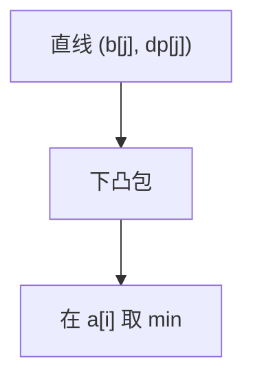

# 斜率优化

$dp[i]=\min_j dp[j]+b[j]\cdot a[i]$ 是直线族在横坐标 $a[i]$ 上的下包络；维护凸壳，查询斜率单调则双指针。

<footer>—— 据凸包维护的标准 DP 优化；Knuth 优化对照后课整理</footer>

上一课[单调队列](/cs/monotone-queue-opt)要求比较与 $i$ 无关。本课 $j$ 的优劣随 $a[i]$ 变：直线 $y=b[j]x+dp[j]$。缺口是凸包技巧（CHT）。不重写 deque 窗口。后课四边形不等式与分治优化。

## 问题

变形使 $dp[i]=\min_j (x_j\cdot a[i]+y_j)+C[i]$。下凸包：斜率 $b[j]$ 单调插入。若 $a[i]$ 单调，队头弹出斜率过小的。否则二分凸包（Li Chao 树点名）。

缺口是几何下包络，不是平面凸包 Graham（后课几何）。

### 先配方再维护

不会配成 $x_j\cdot a[i]$ 就不要硬上 CHT。常数项归 $C[i]$。最大化改上凸包。

竞赛称斜率优化。Li Chao 树维护任意 $x$ 查询。后课 Knuth 优化是另一单调性（四边形）。

## 方法

插入直线（斜率单调则尾部维护凸）。查询 $a[i]$ 单调则头指针。注意精度或整数叉积比较。

动态插入任意斜率用李超树。

## 机制

两条直线交点决定谁在右侧更优。凸包去劣。与单调队列：都是删劣决策，比较函数不同。与单纯形无关。

## 边界

本课不写完整 Li Chao。不写三维 CHT。后课默认：线性 $j\cdot a[i]$ 型 DP 用 CHT。下一课分治优化与四边形不等式。

## 小结

- 直线下包络 = 斜率优化。
- $a[i]$ 单调则队列；否则二分/李超。
- 先配方。
- 出处：凸包维护 DP；几何凸包后课 Graham。
