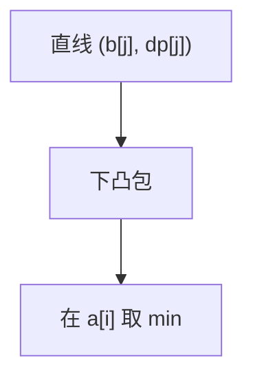
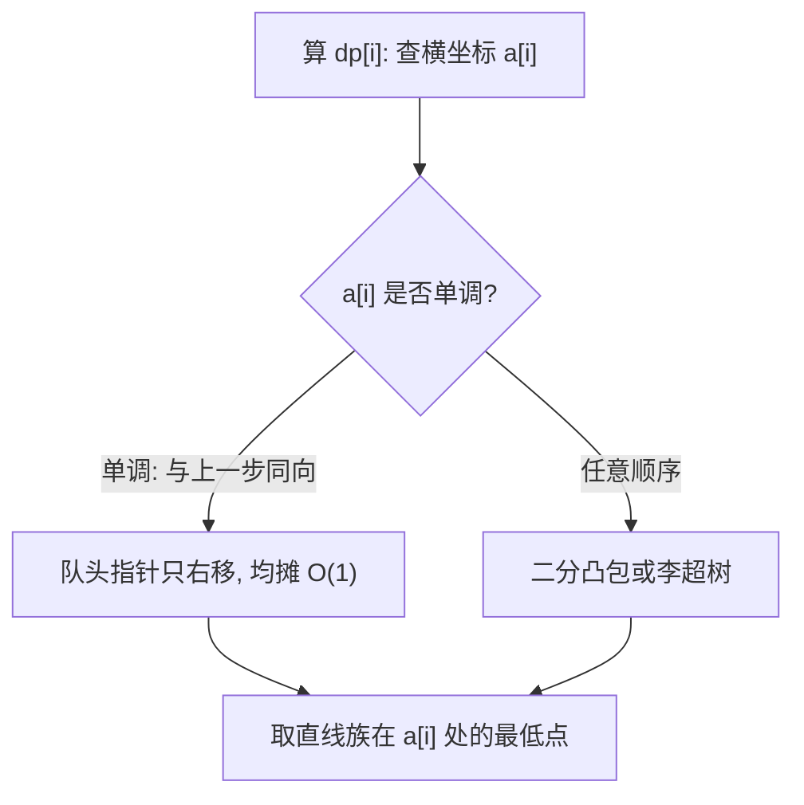

# 斜率优化

$dp[i]=\min_j dp[j]+b[j]\cdot a[i]$ 是直线族在横坐标 $a[i]$ 上的下包络；维护凸壳，查询斜率单调则双指针。

<footer>—— 据凸包维护的标准 DP 优化；Knuth 优化对照后课整理</footer>

上一课[单调队列](/cs/monotone-queue-opt)要求比较与 $i$ 无关。本课 $j$ 的优劣随 $a[i]$ 变：直线 $y=b[j]x+dp[j]$。缺口是凸包技巧（CHT）。不重写 deque 窗口。后课四边形不等式与分治优化。

## 问题

变形使 $dp[i]=\min_j (x_j\cdot a[i]+y_j)+C[i]$。下凸包：斜率 $b[j]$ 单调插入。若 $a[i]$ 单调，队头弹出斜率过小的。否则二分凸包（Li Chao 树点名）。

直觉类比：每个决策 j 是一条直线（斜率 b[j]、截距 dp[j]），查询就是问「横坐标 a[i] 处哪条线最低」。把候选直线全画在纸上，从下往上看，只有最底下那层「下包络」有用，其余直线当场作废。

缺口是几何下包络，不是平面凸包 Graham（后课几何）。

### 先配方再维护

不会配成 $x_j\cdot a[i]$ 就不要硬上 CHT。常数项归 $C[i]$。最大化改上凸包。

竞赛称斜率优化。Li Chao 树维护任意 $x$ 查询。后课 Knuth 优化是另一单调性（四边形）。

## 方法

插入直线（斜率单调则尾部维护凸）。查询 $a[i]$ 单调则头指针。注意精度或整数叉积比较。

```mermaid
flowchart TD
  LIN["直线 (b[j], dp[j])"] --> HULL["下凸包"]
  HULL --> Q["在 a[i] 取 min"]
```

动态插入任意斜率用李超树。

## 机制

两条直线交点决定谁在右侧更优。凸包去劣。与单调队列：都是删劣决策，比较函数不同。与单纯形无关。

```mermaid
flowchart TD
  Q["算 dp[i]: 查横坐标 a[i]"] --> M{"a[i] 是否单调?"}
  M -- "单调: 与上一步同向" --> HEAD["队头指针只右移, 均摊 O(1)"]
  M -- "任意顺序" --> BIN["二分凸包或李超树"]
  HEAD --> ANS["取直线族在 a[i] 处的最低点"]
  BIN --> ANS
```

数字实例：直线 A: y=2x，直线 B: y=5x−30，交点在 x=10。查 a[i]=5 时 A 给 10、B 给 −5，B 赢；查 a[i]=15 时 A 给 30、B 给 45，反超。凸包记住的正是「每段横坐标区间上谁最低」以及交点分界，查询时一步跳到当前区间的主人。

## 边界

本课不写完整 Li Chao。不写三维 CHT。后课默认：线性 $j\cdot a[i]$ 型 DP 用 CHT。下一课分治优化与四边形不等式。

## 小结

- 直线下包络 = 斜率优化。
- $a[i]$ 单调则队列；否则二分/李超。
- 先配方。
- 出处：凸包维护 DP；几何凸包后课 Graham。

常见误区：拿到 DP 就硬套斜率优化。若配不出「x_j·a[i] + y_j + 常数」的形状——交叉项不是线性乘积——硬上只会画不出直线。正确顺序是先配方：常数项归 C[i]，配不成就转向四边形不等式或分治优化。
