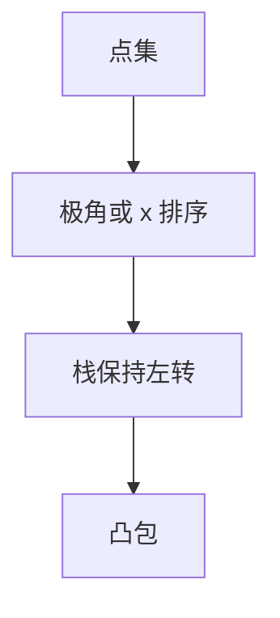

# 凸包 Graham / Andrew

平面点集的凸包是包含所有点的最小凸多边形；排序后单调栈判左转，Graham $O(n\log n)$，Andrew 上下链同阶。

<footer>—— 据 Graham, An Efficient Algorithm for Determining the Convex Hull of a Finite Planar Set, 1972；Andrew, 1979；CLRS 第 33 章整理</footer>

上一课[正则匹配](/cs/regex-backtracking)收束串。平面几何从凸包起。缺口是凸包算法：叉积定向、共线。不重写排序下界。后课旋转卡壳在凸包上转。本课只静态点集。

## 问题

凸包顶点按逆时针。Graham：最低点（再最左）为极点，极角排序，栈上保持左转。Andrew：按 $x$ 排序，做下凸链与上凸链，共线策略统一。二者排序 $O(n\log n)$ 主导。Jarvis 礼品包装 $O(nh)$，$h$ 为包上点数。

缺口是栈与叉积，不是半平面交（后课）。

### 极角排序要稳定共线

叉积为零时按距离。Andrew 少用 `atan2`，数值更好。不要无排序声称 $O(n)$——需要额外假设（整数网格三点不共线等）或更重理论。

Graham 1972。Andrew monotone chain 1979。CLRS 33.3。后课旋转卡壳、直径。

## 方法

去重点。Andrew：排序，正反各扫一次栈。输出去掉重复端点。

下包络是凸包的一半。

## 机制

左转 = 叉积 $>0$（约定）。凹处弹出。排序后相邻才可能是边。与 CHT：CHT 是对偶直线，本课是点。与 MST：凸包不是生成树。

## 边界

本课不写三维凸包。动态凸包点名。后课默认：平面凸包 $O(n\log n)$ Graham/Andrew。下一课旋转卡壳。

## 小结

- 排序 + 单调栈左转。
- Andrew 上下链少极角。
- 主导项是排序 $O(n\log n)$。
- 出处：Graham, 1972；Andrew, 1979；CLRS 第 33 章。
