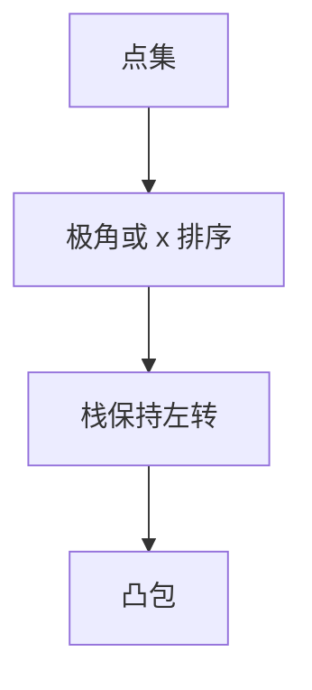
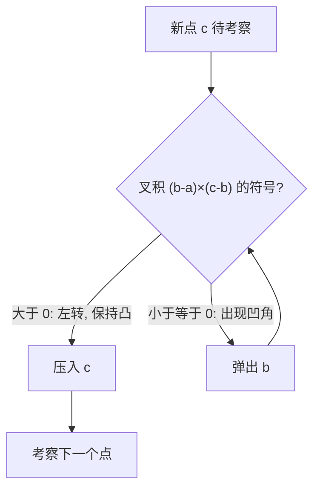

# 凸包 Graham / Andrew

平面点集的凸包是包含所有点的最小凸多边形；排序后单调栈判左转，Graham $O(n\log n)$，Andrew 上下链同阶。

<footer>—— 据 Graham, An Efficient Algorithm for Determining the Convex Hull of a Finite Planar Set, 1972；Andrew, 1979；CLRS 第 33 章整理</footer>

上一课[正则匹配](/cs/regex-backtracking)收束串算法，这里起进入平面几何。给一堆散点，要包住它们的最小凸多边形，顶点逆时针排好——后课旋转卡壳就在这个包上转。缺口是凸包算法本身：怎么用叉积定向、怎么处理共线，以及排序为何绕不开。不重写排序下界；本课只静态点集，不碰插入删除。

## 问题

两条主线。Graham：取最低点（并列再取最左）为极点，其余点按相对极点极角排序，依次进栈，栈里始终保持左转。Andrew（monotone chain）：点按 $x$（再按 $y$）排序，从左到右扫出下凸链、从右到左扫出上凸链，拼成整包。两条路的排序 $O(n\log n)$ 都主导复杂度，栈扫描本身 $O(n)$。当包上只有 $h\ll n$ 个点时，Jarvis 礼品包装 $O(nh)$ 反而可能划算。

直觉类比：把点当成钉在木板上的钉子，凸包就是撑到最大、套住全部钉子的橡皮筋——贴到橡皮筋的钉子在包上，圈在里面的与包无关。算法要做的只是找出橡皮筋经过哪些钉子、按什么顺序。

缺口是栈与叉积，不是半平面交（后课）。

### 极角排序要稳定共线

极角相同（叉积为零）的点必须再按到极点的距离排，共线策略不稳定，包上会留下退化的重复边。Andrew 不算极角、只用叉积，整数坐标下全程精确，数值上比 `atan2` 稳。也不要无排序声称 $O(n)$：那需要额外假设（整数网格、三点不共线等）或更重的理论，不是本课的合同。

Graham 1972。Andrew monotone chain 1979。CLRS 33.3。后课旋转卡壳、直径。

## 方法

先去重点。以下凸链为例：排序后的点依次考察，若栈顶两点与新点构成非左转（叉积 $\le 0$）就弹栈，直到栈内恢复左转再把新点压入；反向再扫一遍得上链。两链共享最左最右端点，拼接时各去掉一个重复端点。

```mermaid
flowchart TD
  PT["点集"] --> SORT["极角或 x 排序"]
  SORT --> ST["栈保持左转"]
  ST --> HULL["凸包"]
```

下凸链正是点集的下包络：每个 $x$ 处最低的那段边界；上链对称，二者相接才是完整凸包。

## 机制

全部判据是一条叉积：$(b-a)\times(c-b)\gt 0$ 表示 $a\to b\to c$ 左转（约定逆时针为正）；凹处弹栈就是把不满足它的点扔掉。排序的作用是保证「栈中相邻才可能是包边」：按 $x$ 排序后，每条包边两侧的点已被天然分开，一遍扫描恰把每条包边各压栈一次；去掉排序，弹栈次序失去意义，这正是 $O(n\log n)$ 下界的落点。与 CHT 区分：CHT 维护的是对偶直线族的最值包络，本课处理点本身。与 MST 区分：凸包不是生成树，两个边集也没有包含关系。

```mermaid
flowchart TD
  NEW["新点 c 待考察"] --> X{"叉积 (b-a)×(c-b) 的符号?"}
  X -- "大于 0: 左转, 保持凸" --> PUSH["压入 c"]
  X -- "小于等于 0: 出现凹角" --> POP["弹出 b"]
  POP --> X
  PUSH --> NEXT["考察下一个点"]
```

叉积 $(b-a)\times(c-b)$ 就是在问「从 b 看去，c 偏在 a 的哪一侧」：为正是逆时针左转，为负是右转，为零是三点共线。两个向量 $(x_1,y_1)$、$(x_2,y_2)$ 的叉积只是 $x_1y_2-y_1x_2$，一次乘一次减，整数坐标下全程无精度损失——这就是 Andrew 比 atan2 稳的原因。

## 边界

本课不写三维凸包（增量法是另一套），动态插入删除的凸包只点名。后课默认：平面静态凸包 $O(n\log n)$，Graham 或 Andrew 任选。下一课旋转卡壳。

## 小结

- 排序 + 单调栈左转。
- Andrew 上下链少极角。
- 主导项是排序 $O(n\log n)$。
- 出处：Graham, 1972；Andrew, 1979；CLRS 第 33 章。

数字实例：n = 10 万个点时，排序约需 170 万次比较，栈扫描只有 10 万次——约九成工作量花在排序上。所以「不排序做到 O(n)」省掉的是大头，这正是它需要额外假设（整数网格、点已给出次序等）才成立的原因。
