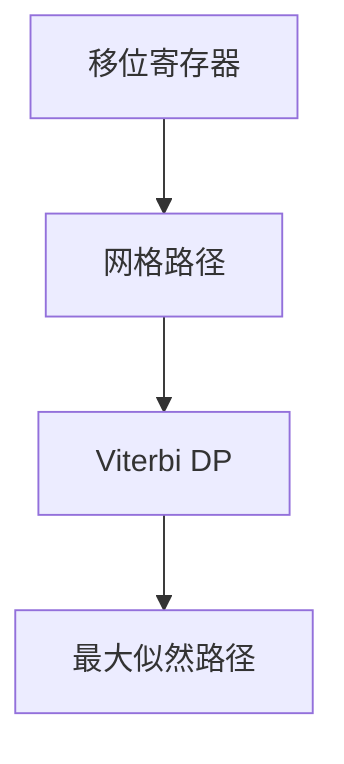

# 卷积码与 Viterbi

卷积码用移位寄存器把信息流编成网格上的路径；Viterbi 在网格上做最短路，按汉明或欧氏度量最大似然译码。

<footer>—— 据 Viterbi, 1967；Forney；Lin and Costello 整理</footer>

上一课[Reed–Solomon](/cs/reed-solomon) 是块码：固定 $n$。缺口是**流式**：卷积码，记忆 $m$ 的移位寄存器，网格（trellis）。Viterbi 动态规划找最可能路径。深空通信、旧移动通信的经典内码。不重写 RS 插值。

## 问题

每拍吃 $k$ 比特，吐 $n$ 比特，依赖最近 $m$ 拍。状态 $2^{m}$ 量级。合法码字 = 网格从零状态走出的路径。噪声下观测偏离路径。Viterbi：对每个状态保留到达它的最优度量，向前递推——与主干最短路同一 DP 形状，边权是局部失真。

自由距离：两路径分叉再合并的最小重量，扮演 $d_{\min}$。尾咬或归零处理块尾。

### 不是隐马尔可夫的新课

网格译码与 HMM 的 Viterbi 同名同算法。本课对象是纠错码路径，不估计自然语言。度量可以是汉明（硬判决）或对数似然（软判决）。

Viterbi 1967。Forney 把卷积码讲成网格。Lin–Costello 教材。BCJR 后验概率译码是 Turbo 的组件，下一课。

## 方法

画 $m=2$ 的小网格，标一条信息路径。说明删边（硬判决）如何变成最短路。复杂度：时间 $\times$ 状态数，状态指数于记忆，故 $m$ 不能很大——这是后课 LDPC 换稀疏图的原因。

主干[区间 DP](/cs/interval-dp) / 最短路已有递推；这里格子是时间 $\times$ 寄存器状态。

## 机制

卷积码把冗余摊在时间上，适合流。级联：外 RS、内卷积，是 NASA 标准故事。达不到一般信道的容量极限（记忆短时），但实现成熟。Turbo 用两个卷积交织迭代，下一课。

生成多项式 $g_i(D)$ 描述寄存器抽头。删余（puncturing）提高速率。软判决把边权改成 $-\log p(y\mid x)$，仍是 Viterbi。BCJR 算后验，Turbo 要用，本课 ML 足够。记忆 $m=6$ 的 NASA 标准码是课堂史，不是容量极限。

## 边界

本课不写多项式生成元 $g(D)$ 的全部代数，不证 Viterbi 最优。不引入 TCM 调制。后课默认：网格码用 Viterbi 最大似然。下一课近容量：LDPC 与 Turbo。

网格把最大似然变成最短路，状态数随记忆指数。这是短记忆实用、长记忆不可行的原因，也是下一课改用稀疏图迭代的动机。软判决只改边权。

上一课留下的缺口在本课收口；「卷积码与 Viterbi」进入后课词汇表后只引用。文献用来钉对象与边界，不把本课写成该主题的独立综述。

## 小结

- 卷积码 = 移位寄存器 $\to$ 网格上的路径。
- Viterbi：状态上的最短路 / 最大似然。
- 记忆短则状态少，距离与容量有限。
- 出处：Viterbi, 1967；Forney；Lin and Costello。
