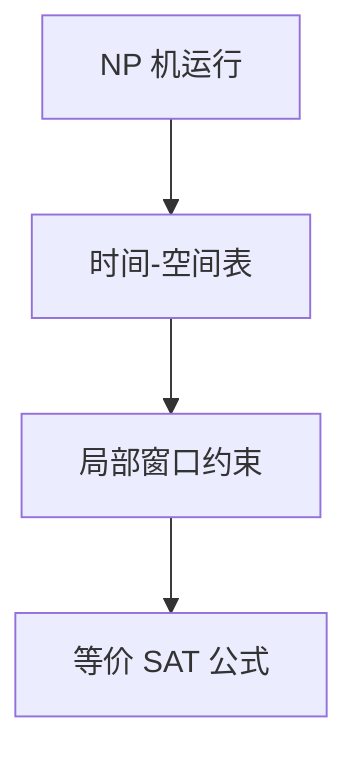

# Cook–Levin 定理

SAT 是 NP 完全的：任意多项式时间验证器的计算表格，都可以多项式变成一份布尔公式，可满足当且仅当证书被接受。

<footer>—— 据 Cook, 1971；Levin, 1973；Sipser 整理</footer>

[上一课](/cs/nl-l-classes)把对数空间类钉完。主干[P 与 NP](/cs/p-vs-np) 定义了类，[多项式归约](/cs/np-reduction) 练了箭头，完全性那一课点名 SAT。本课是补层：把 **Cook–Levin** 的构造形状写清——表格、局部窗口、为何落在 NP。不重定义证书，不列 Karp 的 21 题。

## 问题

NP 机 $N$ 在 $x$ 上有多项式长接受路 $\iff$ 存在证书。把运行摊成时间 $\times$ 空间的表格：每格是带符号或状态。合法表格 = 起始行写 $x$、每 $2\times 3$ 窗口符合 $\delta$、某格出现接受。窗口条件是常数大小布尔约束。合取全体窗口得公式 $\varphi_x$，变量即格内容。$x\in L(N)\iff\varphi_x\in\mathrm{SAT}$。$|\varphi_x|$ 多项式。故一切 NP 问题 $\le_p$ SAT。SAT 本身在 NP：猜赋值，验子句。于是 SAT NP 完全。

3SAT 再局部改写成三元子句，完全性留下。

### 不是「SAT 很难」的经验

定理是完全性，不是下界。若 SAT 在 P 则 $P=NP$。表格构造对确定机同样能做，那只会证明 CIRCUIT-SAT 一类 P 完全（空间对数归约），对象换了。

Cook 1971（Turing 归约味道更重）；Levin 1973 独立，且强调搜索问题。Garey–Johnson、Sipser 用 Karp 多一版表格。本课用多一。

## 方法

画 $T\times S$ 表，$T,S$ 多项式。列窗口合法性。输出 CNF（或任意公式，再多项式化 CNF）。强调变量个数 $O(T S\log|\Gamma|)$。不要把归结或 DPLL 请进来——那是求解，后课逻辑单元。

[布尔代数](/cs/boolean-algebra) 已给与或非；这里公式是符号串，真值是证书。

## 机制

局部性是关键：TM 一步只动一头，故全局合法 = 处处窗口合法。换 RAM 或电路，同样「局部检查计算」。后课电路复杂性把这张表竖过来变成电路族。PCP 会再把验证局部到查几个比特。

有了 SAT 完全，Karp 清单才是「从 SAT 往外化」，不必再对每个问题摊表格。

窗口宽 $O(1)$ 是因为 TM 头一步只碰常数格。换成 RAM 要先模拟成 TM，或直接用电路。3SAT 的拆句在主干[SAT](/cs/sat-3sat) 已写：长子句引进新变元。本课表格是根，Karp 清单是从根长出的枝，不必再对团问题摊一遍运行表。

## 边界

本课不证 3SAT 的子句改写细节全文，不引入 1-in-3 SAT。不讨论平均情形 SAT。后课默认：NP 完全的根是 Cook–Levin 表格。下一课 coNP 与多项式层级。

表格构造一旦会写，SAT 就是 NP 的根，不必对每个新问题再摊运行记录。后课 coNP 问的是否实例有没有同样短的证，不是再证一遍 SAT 完全。

## 小结

- SAT NP 完全：计算表的局部约束 $\to$ 公式。
- 完全性是归约，不是指数下界。
- 此后 NPC 证明从 SAT 出发即可。
- 出处：Cook, 1971；Levin, 1973。
