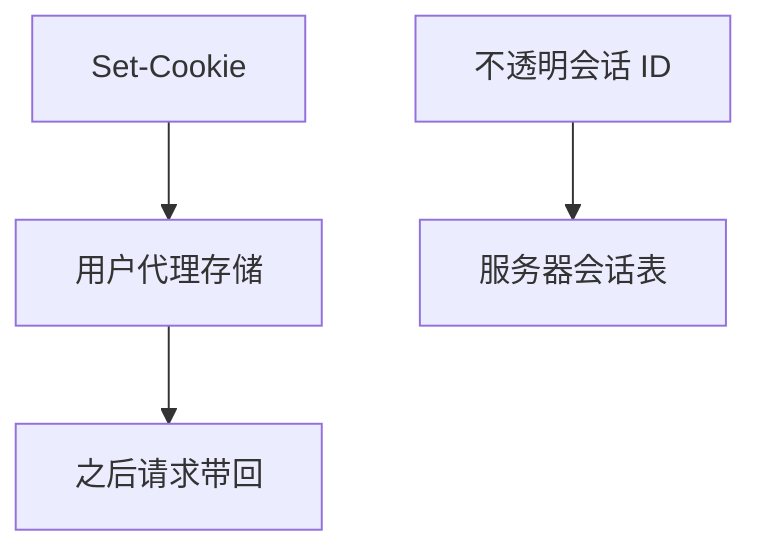

# Cookie 与会话

HTTP 无状态；Cookie 把小块状态交给用户代理回带，服务器才能认出「同一会话」。属性决定范围、寿命与是否只走 HTTPS。

<footer>—— 据 RFC 6265 Cookies；RFC 9110 无状态对照整理</footer>

主干 HTTP 已说无状态。[上一课](/cs/http3) 不改语义。缺口是**会话怎么挂上**：Set-Cookie、作用域、Secure/HttpOnly/SameSite。本课不把内容协商写完。

## 问题

购物车、登录不能每请求重认证密码。Cookie：服务器 Set-Cookie，之后请求自动带 Cookie 头。域名与路径限制范围；Expires/Max-Age；Secure 限制 HTTPS；HttpOnly 挡脚本读；SameSite 减 CSRF。会话 ID 应是随机，服务器侧存会话——Cookie 里只放引用。持久连接复用时必须隔离不同用户，虚拟主机尤其。

不要把 Cookie 写成 JWT 课：可以是不透明 ID。

RFC 6265。第三方 Cookie 在浏览器政策下萎缩，本课钉协议对象。

### HTTP 仍无状态

Cookie 外挂引用，服务器存会话。缓存必须 Vary。0-RTT 带 Cookie 有重放。IP 不能当身份。

## 方法

画：响应 Set-Cookie → 存储 → 后续请求带上。对照：服务端会话 vs 客户端存全部状态。与 QUIC 0-RTT：早数据带 Cookie 有重放，须绑定。

方法止于选定对象与对照；机制才说它如何嵌入已有分层与主干课。

## 机制

CDN 缓存必须对 `Cookie` 与 `Set-Cookie` 正确 `Vary`，否则串会话——后课 CDN 层次。H2/H3 多请求共享连接，Cookie 仍按请求头。NAT 后 IP 不能当身份。TLS 入口提供机密，Cookie 提供关联。

安全：会话固定、CSRF、缺失 Secure 是边界，不写利用手册。

## 边界

本课不引入浏览器存储 localStorage 的全部。内容协商与压缩是下一课。后课默认：会话 = Cookie 引用 + 服务器状态；HTTP 仍然无状态协议。

把整份用户档案放进 Cookie 会超大小且泄露。

上一课留下的缺口在本课收口；「Cookie 与会话」进入后课词汇表后只引用。文献用来钉对象与边界，不把本课写成该主题的独立综述。下一课[内容协商与压缩](/cs/content-negotiation)。

## 小结

- Cookie 在无状态 HTTP 上外挂会话。
- 属性约束范围、寿命与信道。
- 缓存与 0-RTT 要防串会话与重放。
- 后课只引用本课钉死的对象，不从该领域总问题重开。
- 出处：RFC 6265；RFC 9110。
