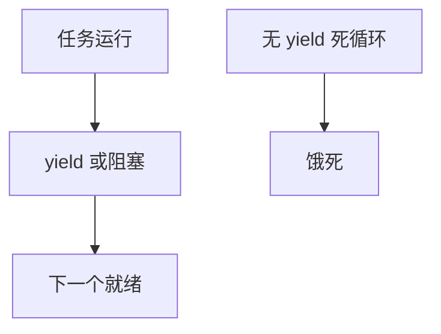
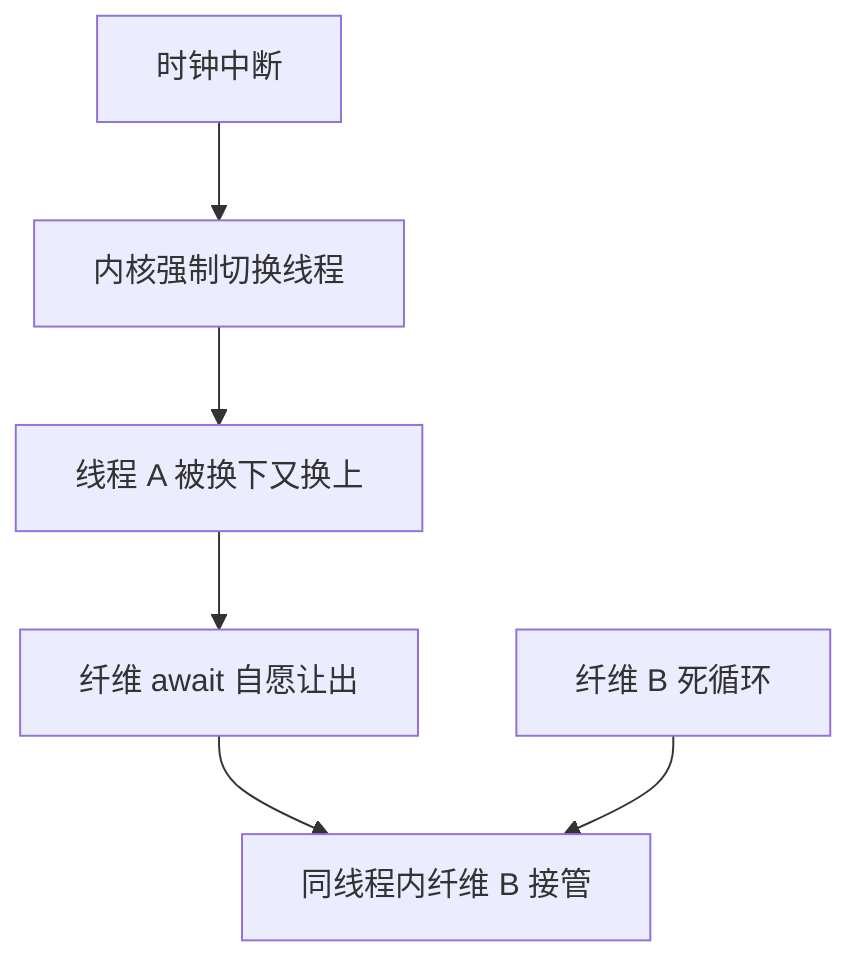

# 协作调度

协作调度只在任务自愿 yield 时换人：无时钟中断抢占，临界区简单，失控循环能饿死全机。

<footer>—— 据 Tanenbaum 对协作与抢占的对照；早期 Mac/Windows 与嵌入式 run-to-completion 实践</footer>

[M:N](/cs/user-level-scheduling) 的纤维切换常是协作的。[PREEMPT_RT](/cs/preempt-rt) 走另一极端。缺口是 **协作作为一等模型**：内核或用户，何时还用。

## 问题

抢占需要保存完整上下文、处理抢占点。协作：`yield`/`await` 才换。缺口：Linux 用户态可 `sched_yield`，但不保证别人跑；内核历史上 `CONFIG_PREEMPT` 关闭则系统调用内协作。本课不把协程语法写成语言课。

run-to-completion 在网卡 NAPI 配额里也有影子：poll 跑到 weight。对象是调度哲学。

初学者容易以为调用了 <code>sched_yield</code> 就等于把 CPU 让了出去。实际上它只是把当前任务挪到同优先级就绪队列末尾：如果没有别人可跑，内核立刻让它继续，一个无让出的死循环照样占满整核。协作模型的「让出」靠的是全员自觉，不是内核施舍。

## 方法

任务跑直到阻塞或 yield。对照 EEVDF：时钟抢占切时间片。对照 [FUSE](/cs/fuse)：守护必须自己不在回调里死循环。对照 DL：硬时限不能指望协作。

```mermaid
flowchart TD
  T["任务运行"] --> Y["yield 或阻塞"]
  Y --> N["下一个就绪"]
  SPIN["无 yield 死循环"] --> STARVE["饿死"]
```

yield 可以翻译成「我用到这了，换人」：切换点由程序员亲手埋进代码，函数内部只要不写 yield，别人就插不进来——这正是协作模型临界区天然简单的根源，也是它怕死循环的原因。

## 机制

协作把正确性（无意外抢占）换饥饿风险，适合可信短任务与教学。现代通用 OS 默认抢占，协作留在用户运行时内部。不要写成倒退推荐。与 [cyclictest](/cs/latency-measurement)：协作内核的 max 延迟可以是「一个长 syscall」。

混合：抢占内核 + 用户协作纤维是常见。

```mermaid
flowchart TD
  TICK["时钟中断"] --> PRE["内核强制切换线程"]
  PRE --> THR["线程 A 被换下又换上"]
  THR --> FIB["纤维 await 自愿让出"]
  FIB --> FIB2["同线程内纤维 B 接管"]
  LOOP["纤维 B 死循环"] --> FIB2
```

混合模型可以想象成公司排班：公司制度（抢占内核）能强制员工到点下班换班，但员工在工位上手头几个活儿怎么轮流（协作纤维）公司不管。Go、Erlang 等运行时都是这个两层结构——线程失控由内核兜底，纤维失控只能靠运行时在编译层插入让出点。

实现上：内核 CONFIG_PREEMPT=n 时，长系统调用等于不可抢占段。用户态协作适合可信短任务。混合模型：内核抢占线程，线程内协作纤维。 读法上只引用[上一课](/cs/user-level-scheduling)的结论，不把对象换成训练推理或限价簿。

本课在操作系统进阶的「调度进阶 / 公平、实时与能耗」课序里，对象是 **协作调度**。

- 先修只引用，不重导：上一课的结论当公理，本课只补差。
- 五栏不吞并：不把本课写成大模型训练/推理，也不写成限价簿或权重量化。
- 文献用 OSTEP、McKusick、内核文档与具名会议论文；不发明 arXiv 编号。

## 边界

本课不引入 Ada 会合的全部。不保证实时协作语言的 WCET 工具。下一课如何评价「公平」：度量。

版本字段会变，课序钉的是机制对象「协作调度」，不是某一主线内核的结构体名。
后课默认：无自愿让出则协作模型可饿死。公平性指标，下一课。

## 小结

- 协作：只在 yield/阻塞时切换。
- 实现简单，失控即饥饿。
- 公平性度量是下一课。
- 出处：Tanenbaum *MOS*；*OSTEP* 调度；历史桌面 OS。
