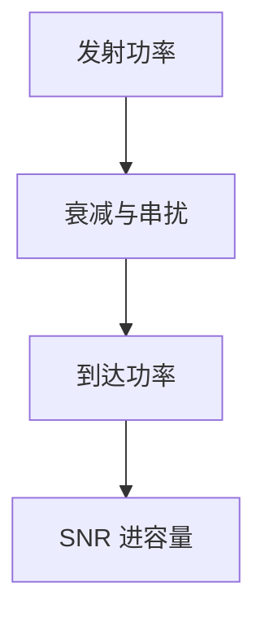

# 铜缆、光纤与衰减

电缆的插入损耗随频率上升，光纤的损耗按波长窗口计价；同一 $C=B\log(1+\mathrm{SNR})$ 里，$B$ 和 SNR 都是介质给的。

<footer>—— 据 TIA/EIA 568 类缆规范；ITU-T G.652 / G.655；Kurose and Ross 物理介质节整理</footer>

[上一课](/cs/clock-recovery-scrambling)假定符号已经过介质到达 CDR。缺口是**介质本身**：双绞线衰减、串扰、长度；光纤的窗口、色散、弯曲。本课不把可插拔光模块的电气约定写完。

## 问题

香农公式里的 $B$ 不是「我想要的带宽」，而是电缆在可接受损耗下还能用的频段。Cat5e/Cat6A 用类别钉串扰与回波；长度 100 m 是信道模型，不是欧姆定律的推论。光纤：1310/1550 nm 窗口损耗低，多模有模态色散限制距离，单模被色散与非线性限制。铜缆上 PAM-4 对回波敏感，所以要回波抵消——这是 SNR 工程，不是新的 MAC。

无线后课的路径损耗换介质，公式同类：距离吃 SNR。

「光纤无限带宽」是口号。窗口有限，放大器有噪声系数，相干光还有相位噪声。本课只钉衰减与带宽谁在约束 $C$。

### 介质给 $B$ 与 SNR

类别与窗口不是营销标签，而是容量公式的输入。换介质不换 MAC 地址；PCS 把损伤挡在 PHY。延迟主要是距离，不是「光比电快」。

## 方法

对照三栏：介质、主导损伤、典型距离。双绞：衰减 + NEXT/FEXT。多模：模态色散。单模：损耗、色度色散、PMD。画：发射功率 − 损耗 − 余量 ≥ 接收灵敏度，剩余即 SNR 预算。

方法止于选定对象与对照；机制才说它如何嵌入已有分层与主干课。

## 机制

主干[帧](/cs/frame-mac)不关心是铜还是光：PCS 把介质差异挡在 PHY。换介质会换调制与 FEC，MAC 帧格式可保持。这是分层：物理损伤不上浮成 IP 选项。

选择：机房内短距用铜便宜；跨楼用多模；跨城用单模。类别升级是为了给更高 $R_s$ 留 $B$，否则只能降阶或缩短。

## 边界

本课不引入非线性薛定谔方程，不把 DWDM 信道间隔写完——下一课光模块与 WDM。后课默认：链路预算 = 功率与损伤；类别与光纤类型是 $B$、SNR 的来源。

不要用「光比电快」当定理：延迟主要是距离与转发，不是电子质量。

上一课留下的缺口在本课收口；「铜缆、光纤与衰减」进入后课词汇表后只引用。文献用来钉对象与边界，不把本课写成该主题的独立综述。下一课[光模块与 WDM](/cs/optical-transceivers-wdm)。

## 小结

- 铜缆：长度、类别约束衰减与串扰。
- 光纤：窗口、色散、模态限制距离与 $B$。
- 预算进入上一课的 $C$，不改 MAC。
- 后课只引用本课钉死的对象，不从该领域总问题重开。
- 出处：TIA-568；ITU-T G.65x；Kurose and Ross。
