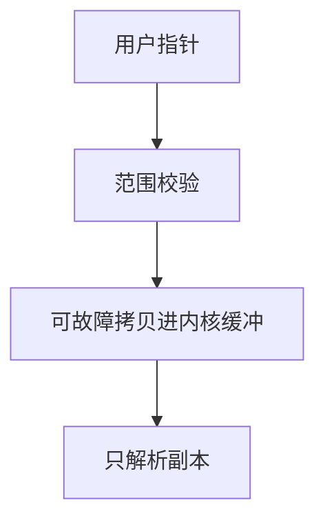

# copy_from_user

内核绝不能信任用户指针一直指向合法、稳定的用户页；要把入参拷进内核缓冲区再解析。

<footer>—— 据 Love, Linux Kernel Development；Tanenbaum and Bos, MOS 整理</footer>

[上一课](/cs/syscall-path)给出自愿陷入的分发：按号跳到实现，并点过「从用户地址空间拷贝入参」。缺口是把那句纪律做成机制：用户指针可能缺页、可能指向内核映射、可能在拷贝途中被另一线程 `unmap`。[分页](/cs/paging-vm)下内核若直接解引用用户地址，轻则读到错误数据，重则破坏内核不变量。本课只钉 **copy_from_user / copy_to_user**，不写利用技巧。

## 问题

ABI 只把指针值放进寄存器。实现若当内核指针用，用户可以把地址指到内核代码或另一进程的页（在共享映射下）。即使地址落在用户范围，页也可能尚未安住，需要走缺页。缺口不是新的系统调用号，而是：**校验范围 → 用可故障的拷贝例程搬字节 → 失败则返回错误，不让内核 oops 成崩溃**。

本课不把每个架构的 `access_ok` 实现写成清单。

拷贝过程允许睡眠（补页）。因此它不能在硬中断上半部里做。上半部与用户缓冲区的会合，仍走下半部与等待队列。

## 方法

内核准备自己的栈上或堆上缓冲区。`copy_from_user`：检查地址落在用户空间，按页搬入，遇缺页则就地处理或失败。字符串还要有上限，避免无界扫描。写出时用 `copy_to_user`，同样不能假设用户页可写一直成立。完成后内核只解析**自己的副本**；用户之后改原页不影响这次调用。

返回值长度、部分拷贝失败，由各调用自己定义；本课只要求失败可见，不把内核状态写到一半当成功。

## 机制

拷贝把[内核与用户态](/cs/kernel-user)的不对称变成操作：用户页对内核「可见」不等于「可当内核对象用」。副本切断了用户并发修改与内核解析之间的数据竞争——至少对这一次入参如此。写出副本则防止内核把内核地址当用户缓冲区交给硬件 DMA；DMA 路径更后，本课只预告：设备地址也不能是未校验的用户指针。

## 边界

本课不讨论如何探测内核布局，不给越界读写的构造。也不把 `get_user` 的单字段快路径写成与块拷贝对立的另一哲学：对象仍是安全搬迁。 seccomp 与能力模型是安全课。

后课默认：系统调用的变长入参先拷进内核。阻塞调用在睡眠中被信号打断后，这次拷贝与这次调用要不要重来，下一课讲重启系统调用。

## 小结

- 用户指针不可直接解引用；拷进内核缓冲再解析。
- 拷贝可缺页、可失败；不能在硬 IRQ 上半部里做。
- 信号打断慢调用是下一课缺口。
- 出处：Love, *LKD*；Tanenbaum and Bos, *MOS*。
