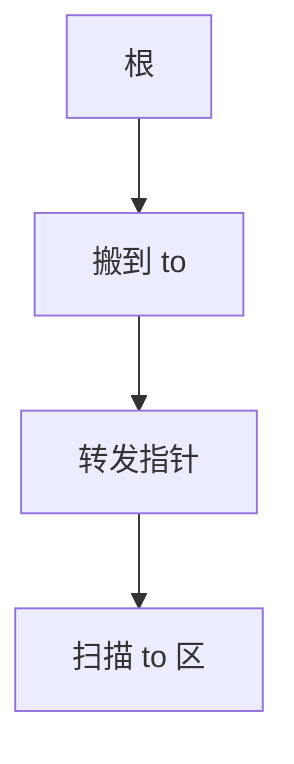

# 复制式 GC

堆分成 from 与 to。从根出发把活对象搬到 to，留下转发指针。结束后交换半区。碎片自然消失，代价是堆只用一半。

<footer>—— 据 Cheney, A Nonrecursive List Compacting Algorithm, 1970；Jones, Hosking and Moss, The Garbage Collection Handbook；主干[标记清除与分代](/cs/gc-mark-gen) 整理</footer>

上一课[JIT 逃逸](/cs/jit-escape-analysis) 减少分配。仍逃逸的对象进堆。主干 GC 课有标记-清扫直觉。缺口是**复制式**：Cheney 扫描、转发。内存管理课序从这里开始。引用计数下一课对照。

## 问题

标记-清扫有碎片，分配要空闲表。复制：bump 指针在 to 区线性分配活对象。缺口是**搬运与指针更新**，不是逃逸分类。

Cheney：用 to 区当队列，广度扫描，无需递归栈。

### 半区不是「浪费一半就慢一倍」

吞吐常更好（只碰活对象）。空间换时间。分代后幼代用复制，老年代另策略——后课。

Cheney 1970。Appel 的简单分代。Jones 手册。主干 runtime-gc、gc-mark-gen。

## 方法

翻转半区。扫描根，搬迁，写转发。扫描 to 区新对象的指针，直到队列空。更新栈与寄存器。JIT：安全点上的栈图给出根。

与精确 vs 保守：保守不能随便搬（不清楚是不是指针）。复制式通常要精确根。

## 机制

大对象可进独立区不复制。多线程：每个线程 TLAB，后课。不要在非安全点搬对象，JIT 寄存器里的指针会丢。

与 deopt 物化：新对象当分配，可直接在 to 或 TLAB。

## 边界

本课不写引用计数。后课默认：幼代常用复制。下一课引用计数 GC。

也不把复制当 memcpy 课。

## 小结

- 复制式：搬活对象，消碎片，堆用半区。
- Cheney 用 to 区当工作队列。
- 需要精确根与安全点。
- 出处：Cheney, 1970；Jones et al. 手册。
