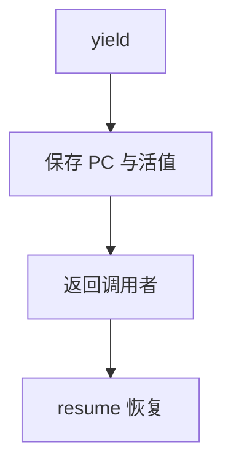

# 协程与生成器实现

生成器是半协程：`yield` 保存 PC 与局部，下次从该点继续。实现或把状态机编到堆帧，或切换独立栈。

<footer>—— 据 Moura and Ierusalimschy, Revisiting Coroutines；C# / Python 生成器实现；对照 CPS 整理</footer>

上一课[CPS](/cs/cps-continuations) 把控制变成函数。生成器不必全 CPS：编译器把函数切成状态机。缺口是**暂停点的帧**。蹦床下一课。不写异步 IO 框架百科。

## 问题

`yield x` 返回值给调用者，但局部还要活。方案 A：变换成类，字段=局部，`switch(state)`。方案 B：独立栈，切换 SP。缺口是**与 GC 根、展开表的关系**，不是 call/cc 全权。

async/await 是生成器+将来值的语法，实现同类。

### 生成器不是操作系统线程

用户态、协作式。不要和抢占线程混。切换代价应远小于 `pthread`。

Moura–Ierusalimschy。Python 的 frame 对象。LLVM 协程表示（CoroSplit）。本课两种实现对照。

## 方法

前端标暂停点。CoroSplit：把 SSA 跨 yield 的值溢到协程帧。调用：resume 恢复 PC。完成：销毁帧。

与闭包：协程帧是环境的亲戚。与 DWARF：展开要认协程帧布局。

## 机制

栈满协程：每个对象一页栈，内存多。状态机：内存少，不能任意深度互递归 yield 除非堆分配。不要在持锁时 yield 而不文档。

异常：在 yield 对面抛，状态机要能传播。

## 边界

本课不写蹦床。后课默认：生成器=可暂停帧。下一课蹦床与尾递归：另一套无栈控制。

也不把协程当化学课。

## 小结

- 生成器：状态机或独立栈保存暂停点。
- 与 CPS 同类控制，实现更特化。
- GC、展开、锁是正确性边界。
- 出处：Moura and Ierusalimschy；语言实现（Python/C#）；LLVM CoroSplit。
