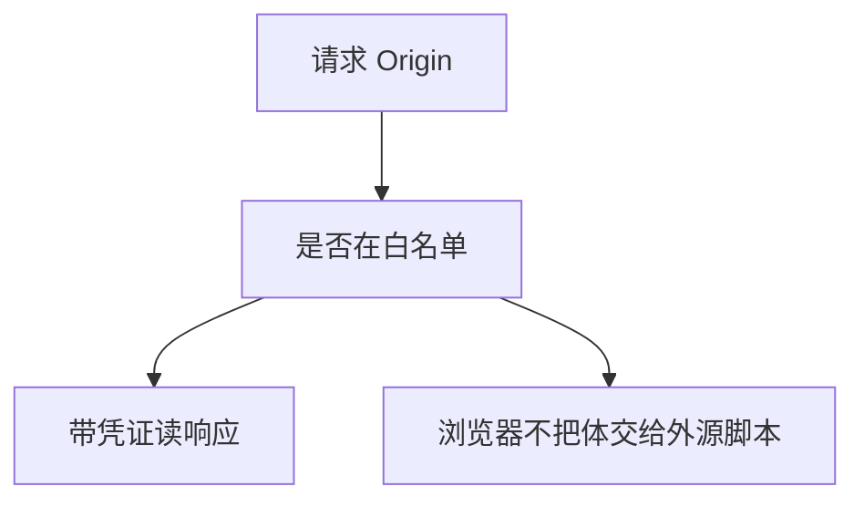

# CORS

同源政策默认不让外源脚本读你的响应。CORS 是服务器显式放行的口子：哪个 Origin、是否带凭证。放行过宽等于把 SOP 拆掉。

<footer>—— W3C CORS；Fetch 标准；对照[同源](/cs/same-origin-csrf)</footer>

## 定位

上一课[CSP](/cs/csp)限制本页外连。缺口是**别人的页想读你的 API**。CORS 预检与 Access-Control 头。不给窃取数据的操作步骤。

后课默认已经读完本课钉下的合同，只补差，不从该领域第一性原理重开。

## 问题

SOP 挡读。API 要给合法前端时，反射任意 Origin 且允许凭证会把带 Cookie 的响应给攻击者源。缺口是白名单精确匹配。

### CORS 不是 CSRF 解

简单请求仍可跨源发出。CSRF 要 SameSite 或令牌。

Fetch 标准。本课禁止利用错误 CORS 的配方，只要求永不反射不可信 Origin。

## 方法

分简单请求与预检。凭证模式。对照点击劫持：那是 UI 层，不是读响应。

图中节点是本课的机制骨架；课程不把图展开成可运行的攻击步骤。

## 机制

保密：跨源读是 C。过宽 CORS 把 API 变成「任何网站都能以用户身份读」。点击劫持下一课是用户在看不见的框里点。

前提写进合同之后，游戏外的误用只当失败模式点名，不在本课写成操作程序。

## 边界

不写 PoC 页。点击劫持下一课。

## 小结

- CSP 管本页；CORS 管谁能读本 API。
- 反射 Origin 加凭证是拆 SOP。
- CORS 不替代 CSRF 防御。
- 下一课点击劫持。
- 出处：W3C CORS / Fetch；[same-origin-csrf](/cs/same-origin-csrf)。
