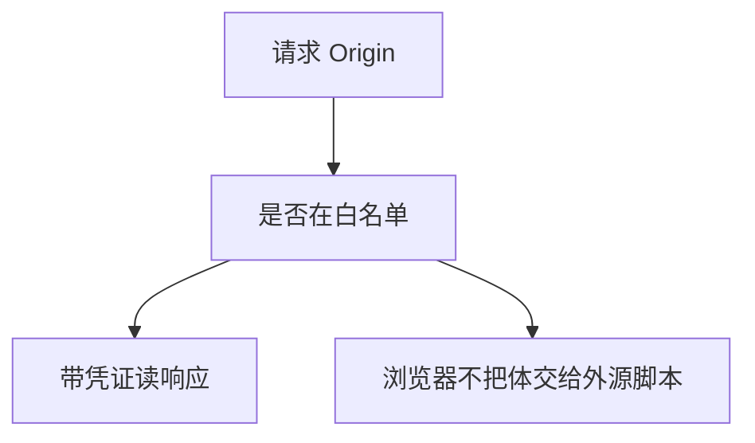
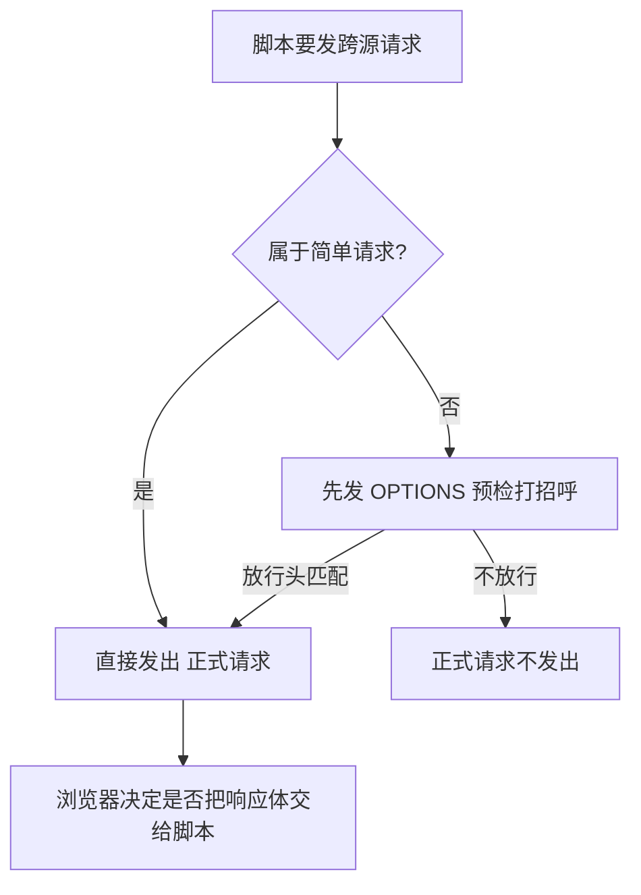

# CORS

同源政策默认不让外源脚本读你的响应。CORS 是服务器显式放行的口子：哪个 Origin、是否带凭证。放行过宽等于把 SOP 拆掉。

<footer>—— W3C CORS；Fetch 标准；对照[同源](/cs/same-origin-csrf)</footer>

上一课[CSP](/cs/csp)限制本页能连什么；缺口是反方向——**别人的页面想读你的 API**。同源政策默认不许，CORS 是服务器显式放行的口子：预检请求与 Access-Control 响应头。不给窃取数据的操作步骤。

后课默认已经读完本课钉下的合同，只补差，不从该领域第一性原理重开。

## 问题

SOP 默认挡住跨源读，这是机密性的浏览器侧防线。API 要服务合法前端就得放行，但放行写错就成了洞：把请求的 Origin 头原样反射、再加允许凭证，等于任何网站的脚本都能带着用户 Cookie 读你的 API 响应。缺口是白名单精确匹配——完整 Origin 字符串比对，不做子串或前缀匹配。

### CORS 不是 CSRF 解

CORS 不是 CSRF 的解：表单、图片标签触发的简单请求本来就允许跨源发出（只是读不到响应），CORS 管不了「请求被发出」本身。CSRF 仍要 SameSite 或令牌。

Fetch 标准。本课禁止利用错误 CORS 的配方，只要求永不反射不可信 Origin。

同源政策可以想象成小区门禁：别处网页可以让请求「送进」你的服务器，但不许顺路拆看回信（读响应）。CORS 就是服务器自己贴出的授权名单，写明哪些外来者有权拆信——名单抄得太松，门禁就形同虚设。

常见误区：以为「CORS 报错＝请求被挡住了」。实际上大多数被拒的跨源请求已经发出、服务器也已经处理，浏览器只是拒绝把响应交给脚本。所以 CORS 不是防火墙，管不住「请求发生」，这才需要 SameSite 与令牌。

## 方法

方法先把请求分两类：简单请求直接发出，浏览器看响应头决定是否把响应体交给脚本；非简单请求先发 OPTIONS 预检，服务器放行才发正式请求。凭证模式下 allow-origin 不得用通配符——标准与常识在此一致。对照下一课点击劫持：那是 UI 层的欺骗，与读响应无关。

```mermaid
flowchart TD
  ORIGIN["请求 Origin"] --> ACL["是否在白名单"]
  ACL --> READ["带凭证读响应"]
  ACL --> DENY["浏览器不把体交给外源脚本"]
```

## 机制

机制定位在 CIA 的 C：跨源读是机密性事件。配置正确时 SOP 仍挡住所有未列名来源；过宽的 CORS 把「只有自家前端能读」改成「任何网站都能以用户身份读」，等于在这个 API 上把 SOP 拆掉——而且这是服务器配置错误，浏览器侧无法补救。点击劫持下一课是用户在看不见的框里点。

```mermaid
flowchart TD
  REQ["脚本要发跨源请求"] --> S{"属于简单请求?"}
  S -- "是" --> SEND["直接发出 正式请求"]
  S -- "否" --> PRE["先发 OPTIONS 预检打招呼"]
  PRE -- "放行头匹配" --> SEND
  PRE -- "不放行" --> STOP["正式请求不发出"]
  SEND --> RD["浏览器决定是否把响应体交给脚本"]
```

预检（OPTIONS）可以翻译成「先打招呼」：要发带自定义头或 PUT/DELETE 这类不寻常的请求时，浏览器先发一个不带业务数据的 OPTIONS 问服务器「等下这种请求你收吗」，拿到匹配的放行头才发正式请求——简单请求则省掉这一步。

## 边界

不写 PoC 页；边界要点名：Origin 头可被非浏览器客户端伪造，CORS 因此从不充当鉴权，只是读权限的补充闸门。点击劫持下一课。

## 小结

- CSP 管本页；CORS 管谁能读本 API。
- 反射 Origin 加凭证是拆 SOP。
- CORS 不替代 CSRF 防御。
- 下一课点击劫持。
- 出处：W3C CORS / Fetch；[same-origin-csrf](/cs/same-origin-csrf)。
