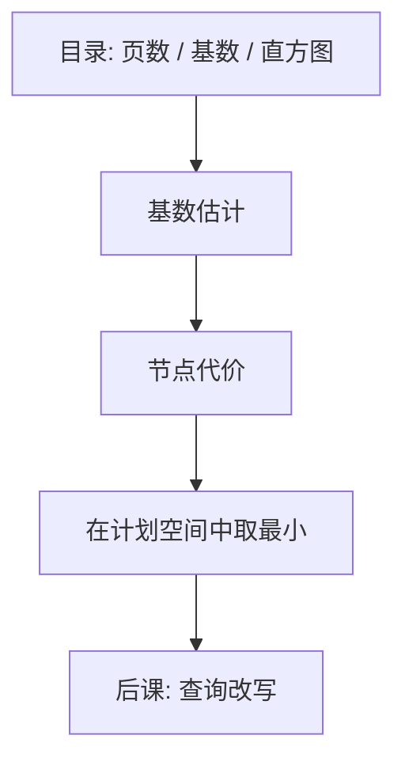

# 代价估计

优化器比较的不是感觉，而是页 I/O 与 CPU 的估计；统计错了，再漂亮的搜索也选错树。

<footer>—— 据 Selinger et al., 1979；Mannino, Chu and Sager 对目录统计的综述整理</footer>

[上一课](/cs/query-plan)把查询收成物理计划树。本课不重画迭代器。缺口是：候选计划很多，必须给每棵树一个可比较的数。代价估计用目录里的基数、选择率与页数，把「看起来快」换成可加的模型；模型错，计划仍合法，只是慢。

## 问题

嵌套循环与哈希连接都实现同一 $\bowtie$，选谁取决于输入多大、谓词多残、内存够不够。缺口不是新算子，而是**统计加公式**：表的页数 $N$、元组数 $T$、索引高度、谓词选择率 $f$。没有这些，System R 式的搜索只是枚举。

本课不把直方图的全部种类写完，只锁定：估计是计划节点上的基数与代价，沿树自底向上加。

独立假设：合取谓词的选择率相乘。相关列上它会错，这是估计的边界，不是「优化器坏了」。后课改写仍依赖这些数来决定是否下推、是否用索引。

## 方法

顺序扫描代价大致与页数成正比。索引点查与树高、叶链长度有关。连接：嵌套循环用外层基数乘内层一次查找代价；哈希连接用建表与探针的 I/O；排序用外排趟数。CPU 项（比较、哈希）可加，但外存主导时页项先钉死。

## 机制

估计沿计划传播：选择改变基数，投影几乎不改（集合下去重才改），连接输出基数用选择率乘两输入。优化器拿总和（或加权 I/O+CPU）给动态规划或启发式搜索当目标函数。缓冲区大小进入公式：嵌套循环是否击中缓冲，改变有效 I/O。

过期统计使估计偏离真实基数，计划仍可运行——[WAL](/cs/wal)与正确性无关，只是选错了树。本课把「正确」与「最优」分开：正确由代数指称管，最优由这套数管。

## 边界

本课不保证最优。搜索空间被剪枝（左深树），代价模型是近似，参数会过期。也不把机器学习代价模型请进主干。分布式、缓存感知的精细模型是实现细节。

直方图与最频值能放松独立假设的一部分，仍是估计，不是计数。后课默认：谈到选计划，先有基数与代价；改写改变的是逻辑树，再重新估计。

优化器是在估计下的搜索，不是证明最快。统计刷新是运维，不是本课的公式。

## 小结

- 计划已在；本课只给树上可加的 I/O/CPU 估计。
- 统计与独立假设会错，选错树不等于查错结果。
- 逻辑改写下一课才动树的形状。
- 出处：Selinger et al., 1979；Ramakrishnan and Gehrke；Garcia-Molina, Ullman and Widom。
