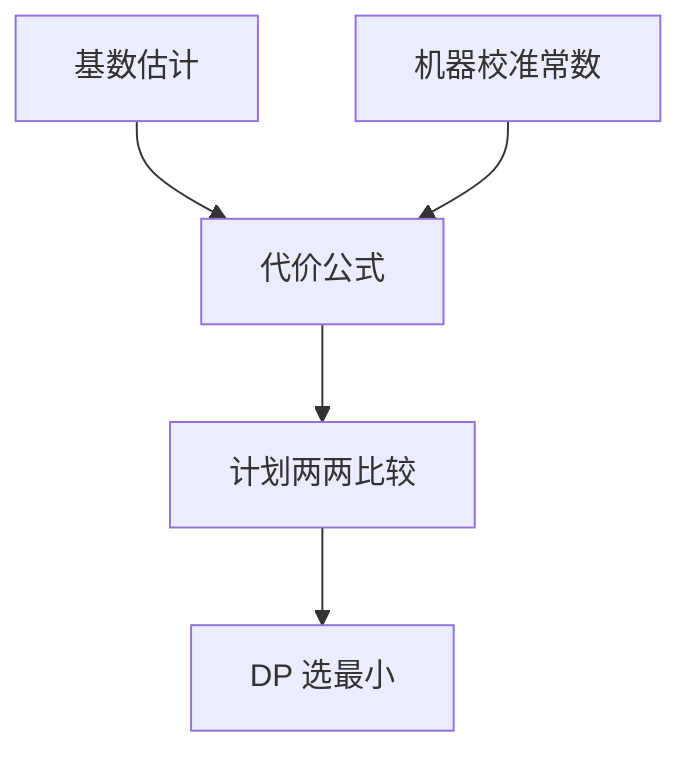

# 代价模型校准

代价是「估计页数 × 随机 I/O 权重 + CPU」。权重来自机器与缓冲池，不来自关系理论；校不准则 DP 用错尺子。

<footer>—— 据 Selinger et al. 的加权公式；Wu et al. 对代价模型；Ramakrishnan and Gehrke</footer>

[上一课](/cs/db-sampling-sketches)改善基数输入。本课不重画 HLL。缺口是把基数译成可比较的标量：同样 10 万行，索引探测与顺序扫描的相对贵贱取决于缓存命中、存储延迟、向量化 CPU。主干代价课给出结构；进阶要校准（calibration），否则「模型内最优」对错机器。

## 问题

Selinger 用 $N_{\mathrm{page}} \times W_{\mathrm{io}} + N_{\mathrm{cpu}} \times W_{\mathrm{cpu}}$ 一类加权。SSD 与 1979 年磁盘的 $W_{\mathrm{io}}$ 差数量级；顺序与随机比也变。缓冲池命中使「逻辑页 I/O」不等于物理 I/O。缺口是**常数与函数形状**：随机探测代价是否随并行度下降、是否区分缓存层。

错校准的典型症状：优化器拒绝索引（以为随机 I/O 极贵）或拒绝顺序扫（以为 CPU 免费）。这与基数估错症状相似，要用「固定真实基数、只改权重」的实验分开。

校准可用微基准：已知选择率的扫描 vs 探测，拟合权重。云上存储延迟抖动，单一常数会漂。本课不把强化学习调参当主干。

## 方法

启动或定期跑校准查询：顺序读、随机读、哈希探测、比较行。把观测时间回归到模型项。缓冲池：代价应考虑命中率或对冷/热分档。并行：后课 exchange 会把 CPU 项除以度，I/O 未必线性——校准要分串行/并行两套或显式函数。

代价是序关系：只要相对顺序对，绝对值错一点 DP 仍可能选对。校准目标是相对序，不是毫秒级预测。

## 机制

向量化与编译执行改变 CPU 项形状（后课执行引擎）。旧模型按「一次一元组」计，会高估表达式贵的计划、低估扫描。校准或模型升级必须与执行引擎一代匹配，否则优化器与执行器各说各话。

云对象存储的延迟方差大，最坏 I/O 权重会让优化器过度避免扫描——HTAP 与存算分离后课再碰到。

## 边界

本课不在执行中途改计划——下一课自适应查询处理。也不把提示当校准：提示绕过模型，校准是修模型。

后课默认：比较计划先确认基数，再确认 I/O/CPU 权重是否像这台机器。自适应处理处理的是「执行时发现错了」。

尺子错了，最短路算法再正确也走到错的城。

## 小结

- 代价常数依赖存储与 CPU，需校准；目标是相对序。
- 执行引擎换代要重校准 CPU 项。
- 自适应查询处理下一课：静态校准仍不够时，执行中观察再调整。
- 出处：Selinger et al.；代价模型文献；Ramakrishnan and Gehrke。
