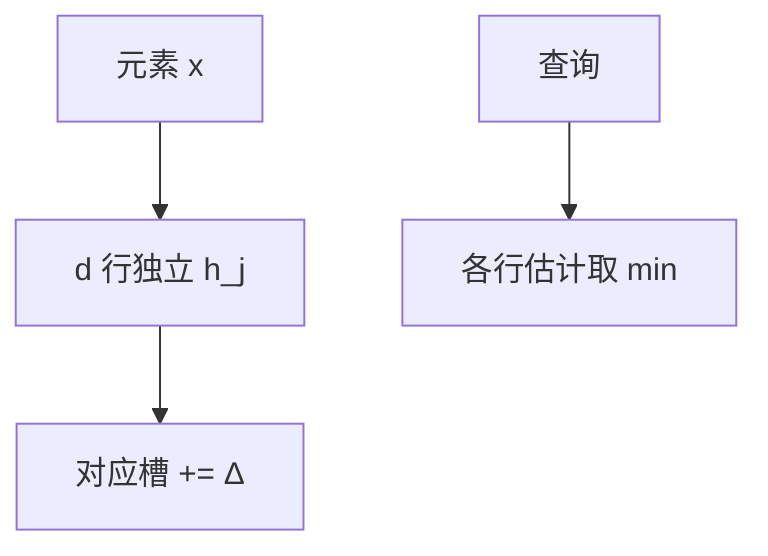

# Count-Min Sketch

若干行哈希表只做加法和取最小；点查询是各行估计的最小，偏高但不偏低（非负流）。

<footer>—— 据 Cormode and Muthukrishnan, An Improved Data Stream Summary: The Count-Min Sketch and Its Applications, J. Algorithms 2005 整理</footer>

[上一课](/cs/consistent-hashing) 仍精确放置键。[通用散列](/cs/universal-hashing) 给出行间独立。[布隆](/cs/bloom-filter) 只回答成员。流上要频次，不能存 $n$ 个计数器。本课不画环。缺口是 Count-Min：宽 $w$、深 $d$ 的计数矩阵。

## 问题

流中元素更新 $(x,\Delta)$，$\Delta\ge 0$。查询 $\hat{f}(x)=\min_j \mathrm{CM}[j,h_j(x)]$。真频 $f(x)\le\hat{f}(x)$。取 $w=\lceil e/\varepsilon\rceil$，$d=\lceil\ln(1/\delta)\rceil$，有 $\Pr[\hat{f}(x)>f(x)+\varepsilon\|f\|_1]\le\delta$。缺口是**用最小压住其它键的碰撞噪音**，空间 $O((1/\varepsilon)\log(1/\delta))$ 与 $n$ 无关。

Cormode and Muthukrishnan, *Journal of Algorithms*, 2005。行哈希 pairwise 独立通常够用。

## 方法

更新：每行 $h_j(x)$ 槽加 $\Delta$。查询取 min。合并：两个同形 sketch 对槽相加，适合分布式。负更新破坏「只偏高」，要 Count-Mean-Min 或换结构，本课钉非负。

与 HyperLogLog：CM 估频次；HLL 估基数。与完美散列：CM 允许错，空间小。

## 机制

碰撞只把别人的质量加进来，故高估。min 降低「某一行特别倒霉」的概率。$\|f\|_1$ 是流总质量，热键相对误差小、冷键可能被噪音淹没——这是草图边界，不是实现 bug。

不要把 CM 当神经网络压缩；是流摘要。

## 边界

本课不把 Count-Sketch（中位数、可负）写完。基数估计下一课 HLL。成员过滤器仍布隆/布谷。

后课默认：非负频次近似用 Count-Min。不同元素个数用 HyperLogLog。

## 小结

- Count-Min：高估频次，空间随 $\varepsilon,\delta$，与 $n$ 无关。
- 查询取行 min；适合非负流。
- 下一课估基数而非频次。
- 出处：Cormode and Muthukrishnan, 2005。
