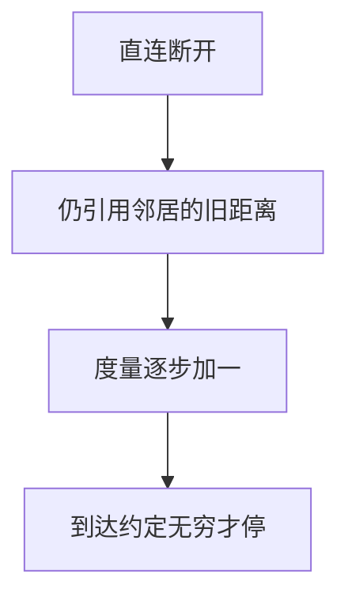

# 计数到无穷

链路断了之后，邻居仍互相引用对方的旧距离，度量一步步加到协议的无穷大；坏消息比好消息慢。

<footer>—— 据 Kurose and Ross 对距离向量缺陷；RFC 2453 对 RIP 无穷与毒性逆转的整理</footer>

[上一课](/cs/distance-vector)把 Bellman-Ford 松弛放到路由器上：交换「到各前缀多远」。本课不重写更新公式。缺口是那一课已经点名、尚未钉死的失败模式：**计数到无穷**。好消息（更短）传得快，坏消息（不可达）在环上被当成「邻居还到得了」。

## 问题

A 经 B 到网 X，代价 1。A–X 直连断开后，A 若立刻改从 B 走，而 B 的表仍写「经 A 代价 1」，双方交替加一，直到度量封顶才认不可达。缺口不是换一张图算法，而是距离向量**只交换摘要、不交换路径**时，无法区分「邻居的距离是否依赖我」。

无穷在 RIP 里常取 16。毒性逆转：从某口学来的路由，从该口通告为无穷。水平分割：不把从某口学来的路由再从该口送出。它们缩短计数，不消灭所有环。

## 方法

检测与缓解：水平分割、毒性逆转、触发更新、度量上限。破环的彻底办法是通告路径或拓扑（下一课链路状态），而不是再加快松弛频率。本课用两节点对偶把机制说清，不把 RIP 报文逐字段背完。

## 机制

距离向量的数据是标量。标量相加在图上正确，当信息过时且形成依赖环时，加法变成「一起数到顶」。控制平面收敛时间可以远大于数据平面上那条链路已经静默的时间。端到端应用只看见丢包与绕路延迟，看不见计数过程。

## 边界

本课不把 BGP 的路径向量提前当解药写完——BGP 带 AS 路径，是后课政策课的对象。也不把振荡的全部计时器组合写成配置指南。链路状态如何避免「只信邻居一句距离」，下一课。

后课默认：摘要距离会在断链后暂时撒谎。通告邻接图并各自计算，下一课链路状态。

## 小结

- 坏消息在距离向量里会沿依赖环加到无穷。
- 水平分割与毒性逆转是缓解，不是证明。
- 链路状态换一种信息，下一课。
- 出处：Kurose and Ross；RFC 2453。
