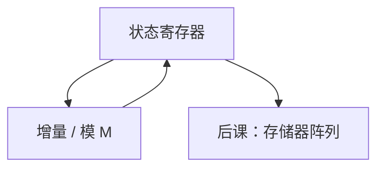

# 计数器

计数器是沿固定环行走的状态机；二进制加一与独热转圈是两种编码，进位链决定延迟。

<footer>—— 据 Harris and Harris, Digital Design and Computer Architecture 整理</footer>

上一课[Moore 与 Mealy](/cs/moore-mealy)钉死了现态寄存器加下一态逻辑。本课不重讲 Moore/Mealy，也不从操作系统时间片另起。缺口是：最常用的一种 FSM 值得单独成块——**计数器**：状态是整数，下一态是加一（或减一），绕模 $2^n$ 或任意模。

## 问题

通用 FSM 真值表对 $2^n$ 个计数状态太笨。缺口是结构：寄存器接加法器（或增量器），使能接「是否计数」，同步复位。模 $M$ 不是 2 的幂时，比较到 $M-1$ 再回 0。延迟：增量器的进位与[加法器](/cs/adder-cla)同类，高速计数要用超前或简单的 toggling 结构（Johnson、线性反馈另说）。

程序计数器是加载型计数器：通常 +4，也能被跳转 MUX 加载——后课数据通路会用，本课先给 +1 模板。

### 异步进位计数器不是同步设计默认

行波计数器把低位 Q 当高位时钟，省组合，但各比特翻转时刻不同，译码会毛刺，也不满足单时钟建立保持模型。主干用同步计数：全体 FF 同一时钟。

Harris 区分异步与同步计数器，推荐同步。后课 DRAM 刷新计数、定时器都是本课块。PC+4 的 4 是字节编址步长，加法器仍是本课增量。

## 方法

同步二进制：$D=Q+1$ 当 en，否则 $D=Q$。模 $M$：下一态组合在 $Q=M-1$ 时出 0。独热计数：移位环，译码免费，状态数等于 FF 数。

## 机制

定时、分频、寻址扫描（用计数输出当译码器输入）都是本课。与 FSM 的关系：计数器是状态图上的一条圈；需要分支（暂停、加载、上下数）时回到带 MUX 的寄存器，仍是 FSM。

时序：增量组合的 $t_{pd}$ 必须满足到下一拍 D 的建立。宽计数器关键路径在进位。

## 边界

本课不讲原子钟、不把 NTP 请进来。LFSR 伪随机是线性反馈移位，不是 +1，后课需要散列时再出现。不把超标量多 PC 提前。

后课默认：计步、刷新、PC+4 都是同步计数/加载寄存器；不用异步行波当系统时钟树。

## 小结

- 计数器是下一态为加一的 FSM，用增量器实现。
- 同步全体共时钟；异步行波不进主干。
- 模非 2 幂靠检测回零；PC 是可加载的计数器。
- 出处：Harris and Harris。
