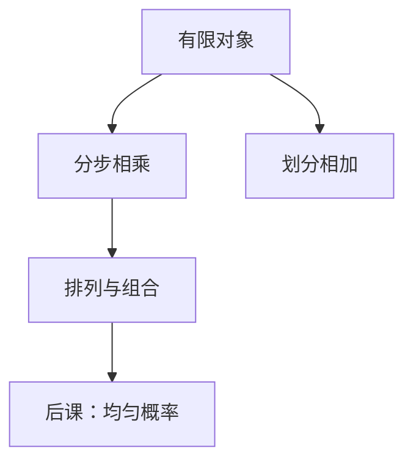

# 组合计数

先分清有序还是无序、是否放回，再套乘法原理；阶乘与二项式只是这几条规则的缩写。

<footer>—— 据 Rosen, Discrete Mathematics and Its Applications 整理</footer>

上一课[树作为无环连通图](/cs/tree-as-acyclic)钉死了树的等价定义。本课不重证 $|E|=|V|-1$，也不从「概率」另起。缺口是：后课概率要把「有多少种」当测度的底；渐近有时也要数操作次数。图和树给出对象，还没有系统的**计数**。

## 问题

树的个数、比特串的个数、从 $n$ 个寄存器里选 $k$ 个，若每次重新发明，后课离散概率没有 $p=\#A/\#\Omega$。缺口因此不是新的图类，而是乘法原理、加法原理（划分）、排列 $P(n,k)=n!/(n-k)!$、组合 $C(n,k)=\binom{n}{k}$、二项式定理。有限 $\Sigma^n$ 的 $2^n$ 在[第一课](/cs/bit-as-distinction)已出现，现在要能数「恰有 $k$ 个 1」的串：$\binom{n}{k}$。

容斥、生成函数点到为止：本课够用的是不放回选取与二项式，不把 Catalan 当主干定理。

### 排列不是「随便排一下」

有序：$n$ 个座位的函数注入。无序：只关心子集。比特上「有 3 个 1」是组合；指令立即数的位型是排列还是组合，取决于是否区分顺序。把 $\binom{n}{k}$ 当成 $n^k$，哈希槽估计会错一个阶。

Rosen 用鸽笼与计数夹在一起。本课计数为主；鸽笼在可数课已有。Cayley $n^{n-2}$ 棵标号树只作例，不证。

## 方法

分步计数则相乘，分类划分则相加。$\binom{n}{k}=\binom{n}{n-k}$，$\binom{n}{k}=\binom{n-1}{k}+\binom{n-1}{k-1}$——后者是归纳与后课动态规划的原型，本课只当恒等式。

## 机制

均匀概率的样本空间大小由本课给出。后课哈希的「生日」用 $\binom{n}{2}$ 对。纠错码的球体积 $\sum_{i=0}^{t}\binom{n}{i}$ 是汉明界的组合部分，[纠错课](/cs/error-correcting-intuition)只谈了距离，计数在这里补上，不重写译码。

树上：有根有序二叉树的个数满足 Catalan 递推，本课承认递推可用归纳验证，不把封闭形式当必考。

## 边界

本课不引入 Stirling 第二类数的全部表，不把无限生成函数当分析课。也不把连续组合（体积）请进来：对象仍有限。

后课默认：数有限结构先问有序与否；均匀随机的分母来自本课。

## 小结

- 乘法原理管分步，二项式管无序选取。
- $\binom{n}{k}$ 计恰 $k$ 个 1 的比特串；排列管有序注入。
- 计数给下一课均匀概率提供 $|\Omega|$。
- 出处：Rosen, *Discrete Mathematics*。
