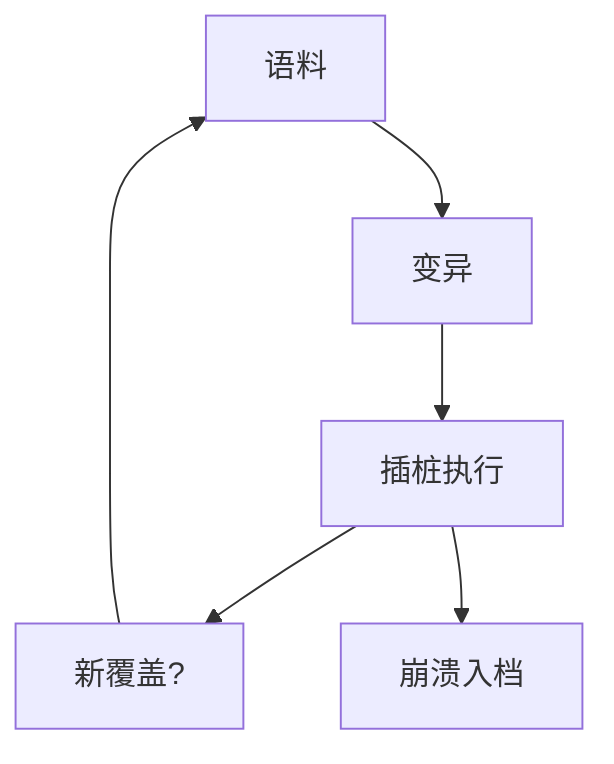

# 覆盖引导 fuzzing

随机输入若能看见「覆盖了新边」，就能把变异压向未走过的分支。AFL 一类工具把程序当仪器，而不是当证明器：找到的是崩溃，不是无洞。

<footer>—— Zalewski, American Fuzzy Lop；libFuzzer；Manès et al., The Art, Science, and Engineering of Fuzzing, TSE</footer>

## 定位

上一课[内存安全语言](/cs/memory-safe-languages)承认遗留 C 仍在。缺口是**如何便宜地找崩溃**：覆盖引导 fuzz。不把符号执行提前讲完。

后课默认已经读完本课钉下的合同，只补差，不从该领域第一性原理重开。

## 问题

手工测试到不了深层分支。插桩记录边覆盖，语料库保留能长覆盖的输入，变异（位翻转、字典）围着它们转。缺口是：无崩溃不等于安全；覆盖不是功能正确。

### 要有预言

只看信号量崩溃会漏逻辑洞。Sanitizer 下一课把更多未定义变成崩溃。

AFL；libFuzzer。本课不提供对第三方产品的 fuzz 作战计划。种子语料来自合法文件。

## 方法

画：语料→变异→执行→覆盖反馈→保留。指出结构感知（协议、语法）提高密度。对照符号执行：精确路径条件，更贵。

图中节点是本课的机制骨架；课程不把图展开成可运行的攻击步骤。

## 机制

发现课把「利用课的洞」变成可回归的测试输入。下一课 KLEE：用约束求解补随机走不到的分支。

前提写进合同之后，游戏外的误用只当失败模式点名，不在本课写成操作程序。

## 边界

本课不写武器化崩溃。符号执行下一课。

## 小结

- 遗留 C 要用自动发现。
- 覆盖反馈引导变异；崩溃是信号。
- 无崩溃 ≠ 无洞。
- 下一课符号执行 KLEE。
- 出处：Zalewski, AFL；libFuzzer；Manès et al., TSE。
