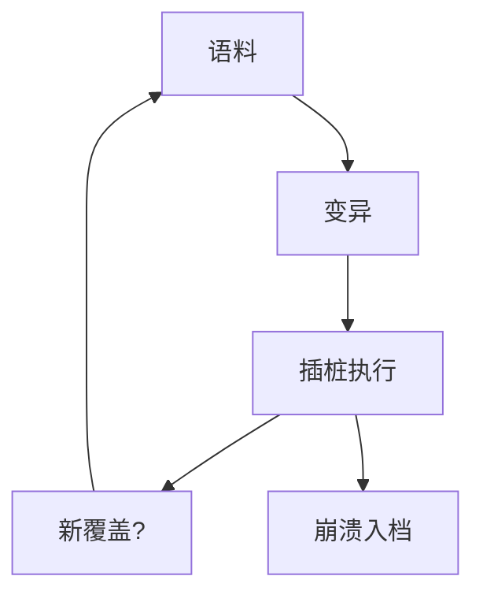
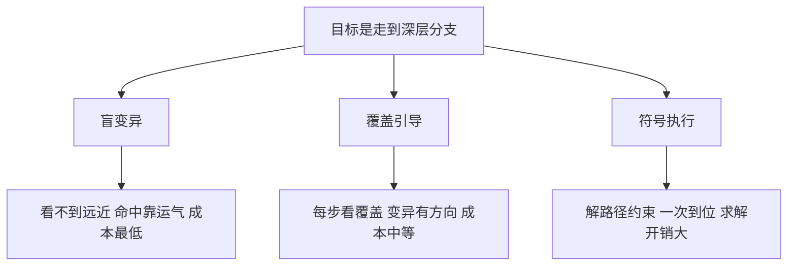

# 覆盖引导 fuzzing

随机输入若能看见「覆盖了新边」，就能把变异压向未走过的分支。AFL 一类工具把程序当仪器，而不是当证明器：找到的是崩溃，不是无洞。

<footer>—— Zalewski, American Fuzzy Lop；libFuzzer；Manès et al., The Art, Science, and Engineering of Fuzzing, TSE</footer>

上一课[内存安全语言](/cs/memory-safe-languages)承认遗留 C 仍在。缺口是**如何便宜地找崩溃**：覆盖引导 fuzz。不把符号执行提前讲完。

后课默认已经读完本课钉下的合同，只补差，不从该领域第一性原理重开。

## 问题

手工测试到不了深层分支。插桩记录边覆盖，语料库保留能长覆盖的输入，变异（位翻转、字典）围着它们转。缺口是：无崩溃不等于安全；覆盖不是功能正确。

### 要有预言

只看信号量崩溃会漏逻辑洞。Sanitizer 下一课把更多未定义变成崩溃。

AFL；libFuzzer。本课不提供对第三方产品的 fuzz 作战计划。种子语料来自合法文件。

插桩可以翻译成「给程序装计步器」：编译时在每个分支处塞一小段代码，把「这条边走过没有」记进共享位图。fuzzer 一看位图有新格点亮，就知道这个输入把它带到了没去过的分支——全程不需要懂程序的业务逻辑。

直觉类比：盲变异像往保险箱上瞎拧转盘，覆盖反馈像每拧对一格就有「咔」的一声——你知道自己更近了，于是顺着这个方向继续拧。语料库就是「到目前为止拧对最多格的那几个转法」的存档。

## 方法

画：语料→变异→执行→覆盖反馈→保留。指出结构感知（协议、语法）提高密度。对照符号执行：精确路径条件，更贵。

```mermaid
flowchart TD
  CORP["语料"] --> MUT["变异"]
  MUT --> RUN["插桩执行"]
  RUN --> COV["新覆盖?"]
  COV --> CORP
  RUN --> CRASH["崩溃入档"]
```

## 机制

发现课把「利用课的洞」变成可回归的测试输入。下一课 KLEE：用约束求解补随机走不到的分支。

```mermaid
flowchart TD
  GOAL["目标是走到深层分支"] --> BF["盲变异"]
  GOAL --> CG["覆盖引导"]
  GOAL --> SE["符号执行"]
  BF --> BFI["看不到远近 命中靠运气 成本最低"]
  CG --> CGI["每步看覆盖 变异有方向 成本中等"]
  SE --> SEI["解路径约束 一次到位 求解开销大"]
```

这张图回答「为什么偏偏选中覆盖引导」：三种技术是成本与精度的阶梯。盲变异便宜但瞎；符号执行精确但求解贵、路径爆炸；覆盖引导用极低的插桩代价换来方向感，是工程上的甜点位。

常见误区：以为「fuzz 跑了一夜没崩＝没有漏洞」。没有预言的 fuzz 看不见逻辑错误——把密码比较写成恒真它也不崩；覆盖率高也不等于功能正确。Sanitizer（下一课）的用处是把越界、未定义行为等更多坏事变成可见崩溃。

## 边界

本课不写武器化崩溃。符号执行下一课。

## 小结

- 遗留 C 要用自动发现。
- 覆盖反馈引导变异；崩溃是信号。
- 无崩溃 ≠ 无洞。
- 下一课符号执行 KLEE。
- 出处：Zalewski, AFL；libFuzzer；Manès et al., TSE。
