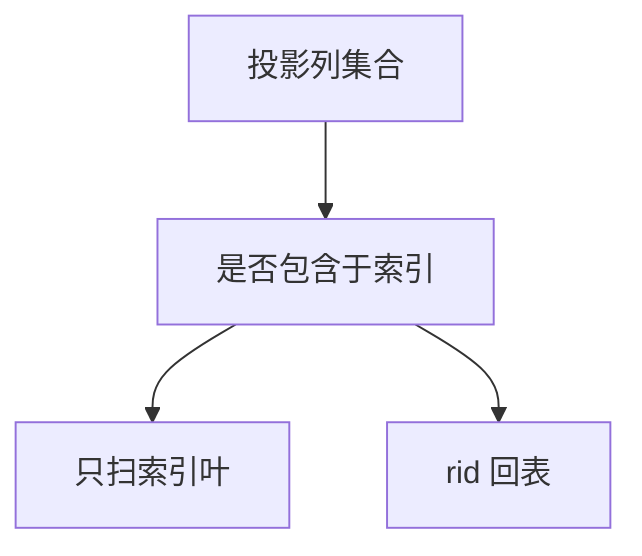

# 覆盖索引扫描

若查询需要的列都在索引键（或包含列）里，扫描可以停在索引页，不必回表取堆行。

<footer>—— 据 Ramakrishnan and Gehrke 对索引只扫描；Date 对物理独立性对照</footer>

[上一课](/cs/views-materialize)把宽接口收成视图或物化。本课不重做维护。缺口是物理访问：B+ 即将在后课展开，但优化器已经需要「覆盖」这一概念——二级索引通常只存键与 rid，回表随机 I/O 很贵。覆盖则叶子上已有投影所需列。页与槽下一课才讲记录布局。

## 问题

视图课留下逻辑宽表。执行仍要选访问路径。二级索引查找后用 rid 回堆，等于随机读。若 `SELECT` 的列是索引键的子集（或引擎支持 INCLUDE 列），索引叶子已是覆盖投影，范围扫描顺序 I/O。缺口是**何时可以不做堆取**，不是 B+ 分裂算法。

覆盖是物理设计：多一列进索引，更新变重、叶子变宽。与物化视图不同，它仍是一种索引，不是另一张用户表。

## 方法

计划里出现 Index-Only Scan：过滤与投影都在索引结构上完成。过滤条件最好对准键前缀，否则退化成索引全扫。堆聚簇（主键顺序存行）是另一种「覆盖」亲戚：主键扫描即数据。本课不把每家 DBMS 的 INCLUDE 语法当标准。

## 机制

覆盖把[选择投影](/cs/algebra-reorder) 的投影推进存储结构，是谓词下推的列方向版本。语义不变：结果关系相同。代价模型应计入叶子页数而不是堆页数。后课页槽解释 rid 指向什么。

## 边界

本课不引入列存当主干替代。记录在页上如何安放，下一课页与槽。

后课默认：有的计划可以不回表。行仍是页上的槽化记录。

## 小结

- 覆盖索引避免回表，服务投影子集。
- 用空间与更新成本换 I/O。
- 页与槽下一课。
- 出处：Ramakrishnan and Gehrke；对照 Date 物理独立性。
