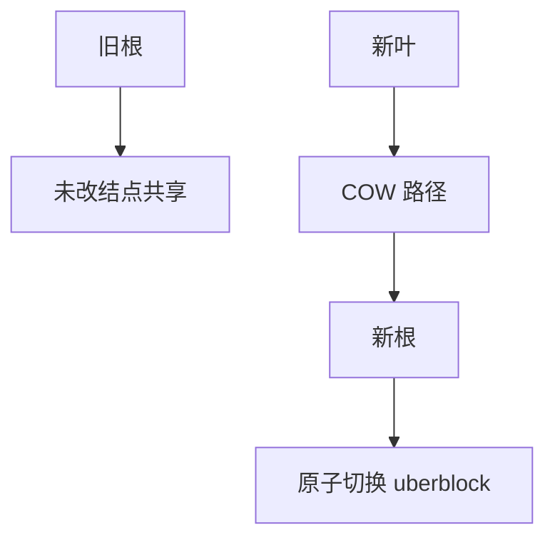

# COW 文件系统 btrfs / ZFS

写时复制不覆盖旧树结点：新叶、新路径、新根；旧根只要还被快照握着，就仍是一致的历史切面。

<footer>—— 据 Rodeh, B-trees, Shadowing, and Clones, TOS 2008；Bonwick and Moore, ZFS 设计讨论；McKusick 对 COW 的对照</footer>

[上一课](/cs/f2fs)的 NAT 更新仍是「一张表的新版本」。若目录、inode、extent 都活在同一棵 B 树里，缺口变成：**一次写复制从叶到根的路径**，于是快照几乎免费。本课对象是 btrfs 与 ZFS 的共同机制，不是发行版选谁。

## 问题

[ext4](/cs/ext4-extents) 原地改 extent 树，快照要另做 lv 或 dump。[LFS](/cs/log-structured-fs) 追加的是段，不是「整棵可命名的树根」。缺口：所有元数据（及可配置的数据）COW；超级块（或 uberblock）原子地指向新根。ZFS 用 DMU + DSL；btrfs 用多棵 B 树（extent、checksum、dir）。本课只钉「影子树」这一课序，不把每棵树的键格式背下来。

引用计数让多根共享未改结点。克隆是加根加计数，不是拷贝盘。校验和存在树里，下一课 scrub 才跑。

## 方法

写数据块：分配新块，写新内容，沿 B 树 COW 到根，提交事务把新根地址写入超级块的下一代槽（ZFS 的 uberblock 环）。读：从当前根下降。与 [JBD2](/cs/ext4-journal) 对照：不必先写日志再 checkpoint 主树——主树的新根就是提交。仍需要写序：数据块先于指向它的指针落盘，或靠事务组与 flush。

## 机制

COW 把「崩溃一致」收成「根指针的原子切换」：要么看见旧根，要么看见新根，中间指针不指向半新半旧的树（若写序正确）。这为快照、克隆、发送接收提供同一原语。相对 FAT/ext2：没有「目录项先写、inode 后写」的经典窗口——窗口换成事务提交点。不要把 btrfs 写成量化栏的写时复制订单簿：对象是文件系统树。

池（zpool）与多设备是存储栈后课；本课只承认 FS 可以把设备拼进自己的分配器，而不是必须先有 LVM。

实现上：引用计数溢出或泄漏会让「删快照不还空间」。ZFS 的 uberblock 环写最内层才提交，btrfs 的 super 也有多副本；提交点都是根指针，不是 JBD2 的 commit 块。 读法上只引用[上一课](/cs/f2fs)的结论，不把对象换成训练推理或限价簿。

本课在操作系统进阶的「文件系统实现 / 布局与日志」课序里，对象是 **COW 文件系统 btrfs / ZFS**。

- 先修只引用，不重导：上一课的结论当公理，本课只补差。
- 五栏不吞并：不把本课写成大模型训练/推理，也不写成限价簿或权重量化。
- 文献用 OSTEP、McKusick、内核文档与具名会议论文；不发明 arXiv 编号。

## 边界

本课不引入 RAID-Z 写洞的全部算术，不把 btrfs RAID 5/6 的历史缺陷当主线。校验巡检与快照用户接口是随后两课。下一课先问：树里的校验和如何发现静默损坏，scrub 扫什么。

版本字段会变，课序钉的是机制对象「COW 文件系统 btrfs / ZFS」，不是某一主线内核的结构体名。
后课默认：元数据树可以 COW 出新根。块级校验与定期 scrub，下一课。

## 小结

- COW 复制到根；旧根可作快照。
- 提交是根指针切换，不是 JBD2 那种旁路日志。
- 校验与 scrub 是下一课的缺口。
- 出处：Rodeh, TOS 2008；Bonwick/Moore ZFS；btrfs 设计文档；McKusick。
