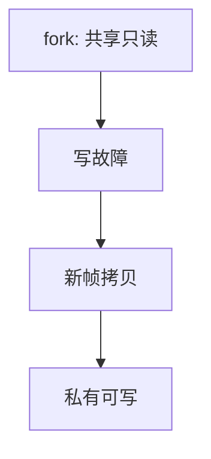

# 写时复制

fork 之后父子共享物理页并标只读；谁先写，谁才得到一份私有拷贝。

<footer>—— 据 Rashid 等对 Mach 虚存的表述；Unix fork 语义在 Bach 与 MOS 中的整理</footer>

[上一课](/cs/overcommit)让物理帧成为稀缺品。[进程映像](/cs/process-image)的 fork 若立刻复制全部用户页，缺页与置换会被自己打爆，而子进程往往马上 `exec` 丢掉刚复制的空间。缺口是**写时复制（COW）**：共享只读，写时再拆。

## 问题

POSIX fork 语义是「子进程地址空间是父的副本」。副本可以是逻辑的：页表指向同一帧，两端页表项去掉写权限。写故障时内核判断是 COW 而非真保护错，分配新帧、拷贝、恢复写权限。缺口不是新的调页，而是把「复制」从 fork 时刻挪到第一次写。

本课不把 `vfork` 与 `clone` 的全部标志写完。

引用计数记有多少页表指向该帧。降到一且本应可写时，可直接恢复写权限，不必拷贝。

## 方法

fork：复制页表项，COW 位 + 只读，帧引用加一。任一方写入 → 缺页 → 若 COW 则拷贝；若引用已为一则只改权限。`exec` 拆掉旧映射，COW 页若仅剩另一进程，引用下降。与[按需调页](/cs/demand-paging)叠：尚未触碰的文件页仍可双方共享同一文件映射，直到写。

## 机制

COW 让「创建进程」与「占用两倍物理内存」解耦，调度可以很快跑子进程。管道课的亲缘进程因此便宜。内核必须区分：文本本就只读，写是 SIGSEGV；数据页的只读可能是 COW。这是缺页处理里的类型字段，不是新的 MMU 周期。

置换仍可淘汰 COW 页：若干净且来自文件，丢掉即可；若匿名且仍共享，要小心写回与引用，实现复杂，主干只承认「共享页淘汰更挑剔」。

## 边界

本课不引入跨进程的 `userfaultfd` 等机制，不把容器快照的全部 COW 文件系统（如 overlay）混进进程页。也不讲硬件的两阶段缺页性能数字。安全课会关心是否漏恢复写位，本课假定实现正确。

KSM 等合并相同页是另一方向的共享，本课不把去重当 fork 语义。

内核在写故障路径上必须序列化引用计数，避免两份都以为自己该独占。

后课默认：fork 后页按写拆分。把文件直接接进地址空间、不一定走 `read` 拷贝，下一课 mmap。

## 小结

- fork 的副本语义可用共享只读 + 写时拷贝实现。
- 真保护错与 COW 故障要在缺页里分开。
- 文件映射进虚空间是 mmap 的缺口。
- 出处：Mach 虚存（Rashid et al.）；Bach, *The Design of the UNIX Operating System*；Tanenbaum *MOS*。
