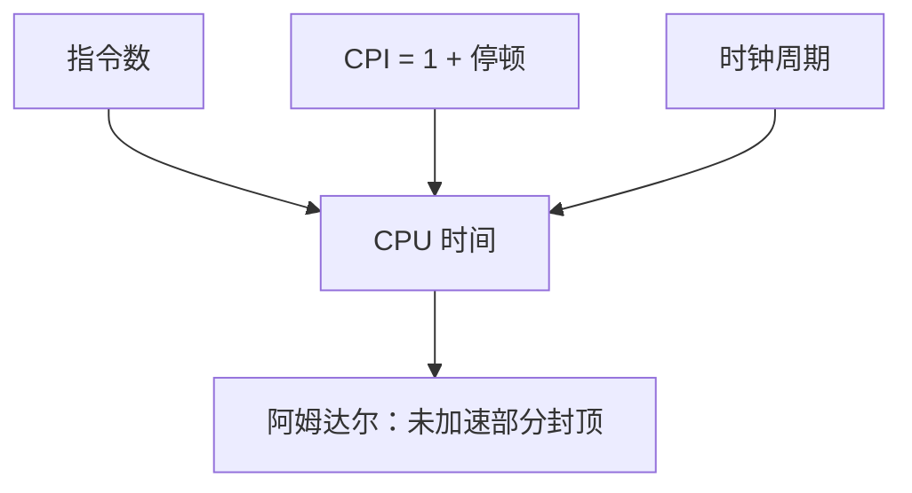

# CPI 与阿姆达尔

加速比被未改进部分卡住；把流水线的理想 CPI 写成 1，真正的时间仍在停顿和那一小段加速不了的工作里。

<footer>—— 据 Amdahl, Validity of the single processor approach to achieving large scale computing capabilities, AFIPS 1967 整理</footer>

[上一课](/cs/delay-slot)把精确异常钉在提交点上，冲刷会丢掉已经取进来的指令。五级、转发、预测、异常路径至此都有了对象。本课不重讲任何一种冒险怎么修。缺口是：还没有把「每条指令多少拍」和「改进一块能快多少」写成可加减的量。本课只交出 CPI 分解和阿姆达尔定律。

## 问题

理想五级的 CPI 是 1。结构气泡、load-use、误预测冲刷、陷阱入口都把平均 CPI 抬高。只说「流水线更快」无法比较两种设计：时钟可能更高，但停顿也可能更多。缺口不是再发明一级流水线，而是**CPU 时间 = 指令数 × CPI × 时钟周期**，并把 CPI 拆成基础 1 加上各类停顿。

Amdahl 进一步问：若只有比例 $f$ 的时间被加速 $s$ 倍，整体加速比是 $1/((1-f)+f/s)$。把全部面积砸在已经很短的那一段上，收益趋零。本课不把定律用到多核负载均衡以外的故事；多核是后课。

Amdahl 1967 的原文针对「单处理器思路能否靠加速一部分达到大规模」；教学上用来约束任何局部优化。

## 方法

记 $\mathrm{CPI} = \mathrm{CPI}_\text{ideal} + \sum_i \text{停顿}_i$。五级理想项取 1；停顿按结构、数据、控制、异常分别计数，再按指令频率加权。CPU 时间用这条乘时钟。比较设计时，同时看时钟能否缩短——转发 mux 可能让周期变长，净效果不一定赢。

加速比 $S = T_\text{old}/T_\text{new}$。若只改进分支预测，把 $f$ 取成原先花在误预测冲刷上的时间比例，$s$ 取成该项的局部加速，整体 $S$ 立刻小于 $s$。

## 机制

定量以后，后课 cache 缺失、TLB 失效都可以加进同一条 CPI 公式，而不必改 ISA。局部性课要解释为什么存储器停顿会主导这项；本课只把公式的位置留好。

阿姆达尔也解释为什么要把常见路径做快：指令频率高的那类停顿，值得加硬件；罕见陷阱路径可以慢。这与特权级里「陷阱罕见」一致，不引入新的保护模型。

## 边界

本课不引入 IPC 大于 1：那是[超标量发射](/cs/superscalar-issue)把理想项改成小于 1 的写法。也不把定律误写成「永远只能加速 20%」——$f$ 来自测量，不是常数。Gustafson 的按比例放大是另一种问题，主干不在这里展开。

后课默认：谈到性能，先写指令数、CPI、周期三项；cache 与 VM 的缺失延迟加在 CPI 的停顿项里。

## 小结

- CPU 时间 = 指令数 × CPI × 周期；五级理想 CPI 为 1，停顿另加。
- 阿姆达尔：整体加速被未改进比例封顶。
- 存储器层次与超标量会改写 CPI 的项，对象仍是这条公式。
- 出处：Amdahl, AFIPS 1967；Hennessy and Patterson, *CA:AQA* 第 1 章。
