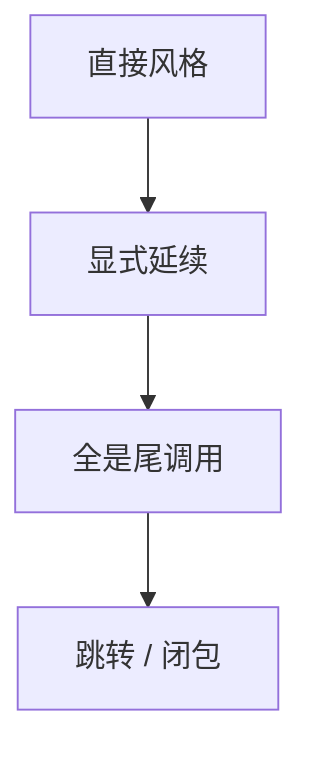

# CPS 与延续

把「剩下要做的事」当成函数参数。CPS 变换后每个调用都是尾调用，控制流变成跳转；call/cc 把当前延续物化。

<footer>—— 据 Steele, RABBIT；Appel, Compiling with Continuations；Plotkin, Call-by-name, Call-by-value and the λ-Calculus 整理</footer>

上一课[闭包转换](/cs/closure-conversion) 处理环境。缺口是**控制**：return、异常、协程都是延续的使用。CPS：`f(x)` 变 `f(x, k)`，$k$ 是「接受结果的函数」。本课钉变换直觉与为何利于[尾调用](/cs/tail-call-opt)。协程下一课。不重写 STLC。

## 问题

直接风格：调用栈隐式延续。CPS：显式。编译器（SML/NJ、早期编译器）用 CPS 作 IR：优化是函数传递。缺口是**这一 IR**，不是闭包字段布局。

call/cc：把当前 $k$ 当成值。实现要能复制或分享栈——重。

### 延续不是「回调 hell 的散文」

JS 回调是粗糙 CPS。完整 call/cc 可多次调用 $k$（若允许），语义更强。不要等同。

Steele RABBIT。Appel CWC。Plotkin 1975。本课编译用途为主。

## 方法

对核心 λ 做 CPS 变换（有多种，注意行政性归约）。然后闭包转换、分配。优化：已知 $k$ 则跳转。异常：把 handler 编进 $k$。

与操作语义：求值上下文就是延续的语法形式。

## 机制

栈：CPS 后若不当尾调用优化会爆栈——必须 TCO。管理性闭包多，要好分配/逃逸。不要把每次 `+` 都真的堆分配 $k$ 而不优化。

与 JIT：CPS IR 少见，但 SSA 也是「剩余计算」的亲戚（Appel 论文）。

## 边界

本课不写协程实现。后课默认：控制可 CPS 化。下一课协程与生成器：一次延续、可暂停。

也不把 CPS 当密码学。

## 小结

- CPS：其余计算当函数参数；调用变尾调用。
- 编译器 IR 或 call/cc 的基础。
- 必须配合 TCO 与闭包优化。
- 出处：Steele；Appel CWC；Plotkin。
