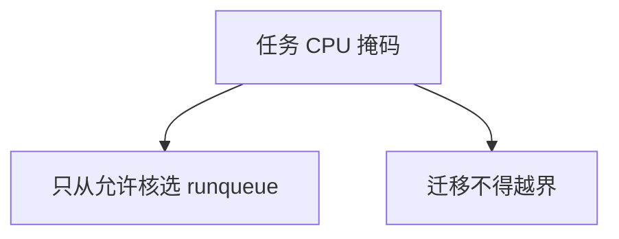

# CPU 亲和

任务的 CPU 掩码限制它能在哪些核上运行；硬亲和保证隔离，软亲和只是迁移启发式不愿离开热缓存。

<footer>—— 据 Love, Linux Kernel Development；Silberschatz et al. 整理</footer>

[上一课](/cs/edf-sched)让期限调度可以选谁上 CPU，还没说「哪颗」。[负载均衡](/cs/load-balance-migrate)默认哪闲迁哪。[中断亲和](/cs/irq-affinity)已经把 IRQ 钉到核上。缺口是**任务的 CPU 亲和**：PCB 上的掩码，调度器与迁移不得违反。本课钉硬/软亲和，不把 NUMA 距离写完。

## 问题

实时核希望旁边没有分时任务；科学计算希望线程不在 SMT 兄弟之间乱跳。硬亲和：掩码外的核对该任务当不存在，平衡器不能为了闲而搬过去。软亲和：内核记住上次跑过的核，能不迁就不迁，但掩码仍是全体。缺口不是 EDF 的截止比较，而是这道约束。

掩码与 IRQ 亲和应对齐：处理线程若不能跑在收中断的核上，上半部与下半部跨核乒乓。

## 方法

用户或管理接口写 `cpuset`/`sched_setaffinity`。唤醒：只在掩码与负载允许的核中选。迁移检查掩码。子进程默认继承。内核线程可绑在某核上跑 per-CPU 工作，与[per-CPU 数据](/cs/percpu)一致。

空掩码非法；只剩的核若全部离线，任务会卡住——管理问题，课内承认约束可以过紧。

## 机制

硬亲和把公平与期限的「全局最优」换成「在子集上最优」。隔离实时：分时任务掩码不含隔离核。代价是：子集过热时不能借用外面的 idle，利用率尺子变差。软亲和降低迁移税，与 CFS 的 cache 热度启发式是同一方向。

与 clone：新线程可另设掩码。不是安全沙箱：亲和不阻止访问内存。

## 边界

本课不把 cgroup cpuset 的全部层级写成容器课。也不讨论用户伪造亲和去占核的政策。内存落在哪一节点、迁过去是否更亏，下一课 NUMA 调度。

后课默认：任务可被钉在 CPU 子集上。访存不对称时还要考虑内存节点，下一课讲 NUMA 调度。

## 小结

- 硬亲和：可运行 CPU 集合；软亲和：不愿离开热核。
- 与中断亲和应对齐；过紧会浪费 idle。
- NUMA 节点距离是下一课。
- 出处：Love, *LKD*；Silberschatz et al., *OSC*。
