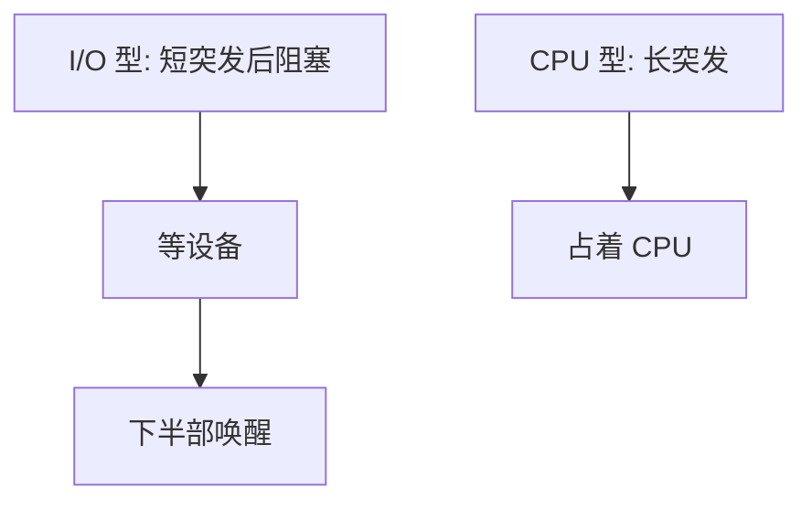

# CPU 型与 I/O 型

作业交替着 CPU 突发与 I/O 突发；偏计算的长突发与偏等待设备的短突发，在同一套指标下要的调度完全不同。

<footer>—— 据 Silberschatz et al., Operating System Concepts 整理</footer>

[上一课](/cs/scheduling-metrics)定义了利用率、吞吐、周转、等待、响应与公平，还没有说就绪队列里的人长什么样。缺口是把线程分成**CPU 型**与 **I/O 型**：前者一次占满量子，后者很快自己睡去等设备。[中断下半部](/cs/interrupt-bottom-half)唤醒的，多半是 I/O 型。本课只钉这种突发结构，不选 FCFS。

## 问题

若调度器把所有人当成永远可跑的计算，I/O 型难得 CPU，设备空闲，利用率反而下降——上一课已点过 I/O 与 CPU 交替能提高利用率，这里收成类型。CPU 型饿死 I/O 型会同时搞坏响应（交互）与利用率（磁盘停转）。缺口不是新的 PCB 字段名，而是用突发长度解释「为什么短作业要插队」。

类型会变：编译开始是 CPU 型，一等头文件磁盘就变成 I/O 型。调度器往往用最近一次突发长度来估计下一次，而不是看进程标签。

## 方法

把执行画成 CPU 突发—阻塞—CPU 突发。I/O 型：短 CPU 突发，频繁进入阻塞。CPU 型：长突发，少阻塞。评价策略时用同一组[调度指标](/cs/scheduling-metrics)，但作业混合必须声明。本课不引入多级队列，只要求后课策略能说出对两类人的偏向。

idle 不是 I/O 型：它不等设备完成一项用户工作，只是队列空。

## 机制

类型把「公平」说清楚：给 I/O 型及时的短量子，它很快让出，CPU 型仍能得到大批时间，响应与利用率可兼得。纯 FCFS 让先到的 CPU 型挡住后面一串 I/O 型，传送带效应下一课会落到具体算法。唤醒只是把 I/O 型放回就绪，**不**保证马上跑——那是调度器的事。

## 边界

本课不把 GPU 计算当成第三种突发类型写进主干。也不把「交互性启发式」的具体睡眠补偿公式当定义。实时任务按期限分类，不按 CPU/I/O 二分。

后课默认：就绪者带着不同的突发长度。这些就绪者在内核里挂成什么结构，下一课讲运行队列。

## 小结

- CPU 型长突发，I/O 型短突发后阻塞；类型可随时间变。
- 亏待 I/O 型会同时损害响应与利用率。
- 就绪集合的数据结构是下一课。
- 出处：Silberschatz et al., *OSC*；Tanenbaum and Bos, *MOS*。
