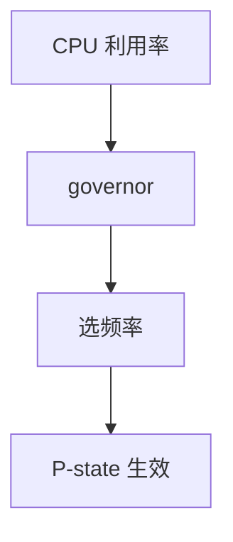

# cpufreq governor

governor 根据利用率选 P-state：performance 钉高、powersave 钉低、schedutil 跟调度器的 util 走。

<footer>—— 据 Linux CPUFreq 文档；ACPI P-state 直觉；[EAS](/cs/eas-scheduling) 为能耗先修</footer>

[公平](/cs/fairness-metrics) 的实验被频率搅动。[异构](/cs/heterogeneous-core-sched) 的容量随频变。缺口是 **cpufreq**：谁决定 MHz，而不是主板 BIOS 百科。

## 问题

硬件有离散频率。ondemand：高 util 跳频。schedutil：用 PELT util 直接映射。intel_pstate 可能绕过通用层。缺口：过渡延迟；与 [NAPI poll](/cs/napi) 造成假 util；用户 `cpufreq-set` 与策略冲突。本课不把每家 MSR 列出。

boost/turbo 是更高 P-state，热墙会收回。对象是策略，不是电路。

## 方法

tick 或更新 util → governor 选 freq → 写 MSR 或 SCMI。对照 [qdisc](/cs/tx-path-qdisc)：一个整形包，一个整形瓦特。对照 DL：实时任务常要 performance。对照 memcg：无关直接。

## 机制

governor 把能耗与延迟的旋钮交给策略，使同一调度器在插电/电池下行为不同。错误的 powersave 把 cyclictest max 打爆。不要写成电费课。与 EAS：选核与选频是一对，分开调会打架。

容器一般不能直接设主机 freq，只能靠自己的 util 间接。

实现上：intel_pstate 在 passive 模式才听 schedutil。boost 受热墙限制，瞬时频率不是承诺。无 tick 的隔离核 util 更新少，governor 会看错忙闲。 读法上只引用[上一课](/cs/fairness-metrics)的结论，不把对象换成训练推理或限价簿。

本课在操作系统进阶的「调度进阶 / 公平、实时与能耗」课序里，对象是 **cpufreq governor**。

- 先修只引用，不重导：上一课的结论当公理，本课只补差。
- 五栏不吞并：不把本课写成大模型训练/推理，也不写成限价簿或权重量化。
- 文献用 OSTEP、McKusick、内核文档与具名会议论文；不发明 arXiv 编号。

## 边界

本课不引入 thermal 框架的全部 trip。不保证虚拟化 pstate 是真硬件。下一课更闲时：C-state。

版本字段会变，课序钉的是机制对象「cpufreq governor」，不是某一主线内核的结构体名。
后课默认：频率由 governor 跟踪 util。空闲核进哪一档 C-state，下一课 cpuidle。

## 小结

- governor 把 util 映射到 P-state。
- schedutil 与调度器共用 util。
- cpuidle/C-state 是下一课。
- 出处：Linux CPUFreq；ACPI；EAS 文档。
