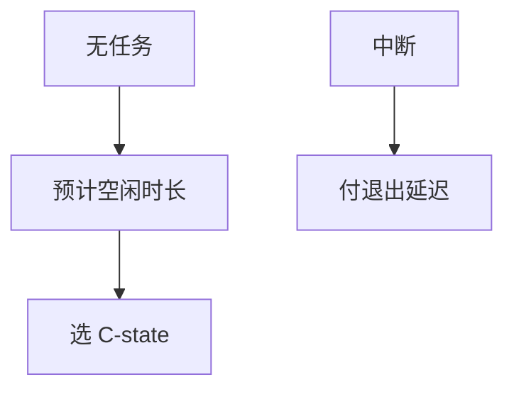

# cpuidle 与 C-state

C-state 越深越省电，退出延迟越大；cpuidle 根据预计空闲时间选档，避免刚睡就被包打断。

<footer>—— 据 Linux cpuidle 文档；ACPI C-state；[NAPI](/cs/napi) 与 [轮询 I/O](/cs/io-polling) 为忙碌对照</footer>

[cpufreq](/cs/cpufreq-governor) 管忙时频率。核 idle 时管 **睡多深**。缺口是 cpuidle：菜单 governor、与中断的博弈。

## 问题

poll 路径（DPDK、IOPOLL）故意不进 C-state。普通服务器：idle → 选 C1/C6…。预计空闲来自调度器（下一个 tick 或 hrtimer）。缺口：错估则 exit 延迟伤害 [cyclictest](/cs/latency-measurement)；nohz 后课改「下一个 tick」。本课不把每个 CPU 的 residencies 表抄来。

tick 会阻止最深 C-state。irq 亲和把打断集中到部分核，让别的核能睡。

## 方法

`cpuidle_enter`：查预测 → 选 state → `mwait`/WFI。唤醒：中断，记 residency。对照 EAS：忙时选核选频，闲时选 C。对照 [zswap](/cs/zswap)：一个用 CPU 换内存，一个用延迟换焦耳。

## 机制

cpuidle 把空闲变成分级睡眠，使平均功耗可降，代价是最坏唤醒。RT 系统常限制最深 C。不要写成电池广告。与 [RSS](/cs/rss-multiqueue)：包若打到睡眠核，要付 exit。

错误预测在高 IRQ 率下会振荡，菜单 governor 有修正。

实现上：预测过深则 wakeup 付长 exit 延迟，cyclictest max 爆炸。poll 忙等的核 residency 为 0。irq 亲和把打断集中，让旁核睡得着。 读法上只引用[上一课](/cs/cpufreq-governor)的结论，不把对象换成训练推理或限价簿。

本课在操作系统进阶的「调度进阶 / 公平、实时与能耗」课序里，对象是 **cpuidle 与 C-state**。

- 先修只引用，不重导：上一课的结论当公理，本课只补差。
- 五栏不吞并：不把本课写成大模型训练/推理，也不写成限价簿或权重量化。
- 文献用 OSTEP、McKusick、内核文档与具名会议论文；不发明 arXiv 编号。

## 边界

本课不引入 S-state 睡眠整机——[挂起](/cs/suspend-resume) 后课。不保证虚拟机 halt 是真 C-state。下一课关掉周期性 tick：tickless。

版本字段会变，课序钉的是机制对象「cpuidle 与 C-state」，不是某一主线内核的结构体名。
后课默认：空闲可选深 C-state。无任务时可停时钟中断，下一课 tickless。

## 小结

- C-state 用退出延迟换功耗。
- cpuidle 按预计空闲选档。
- tickless 是下一课。
- 出处：Linux cpuidle；ACPI；Intel idle。
