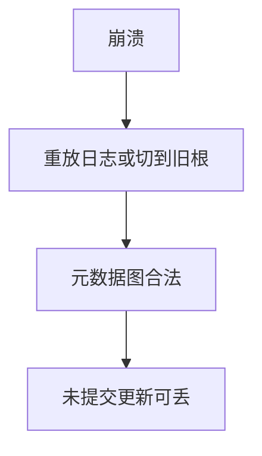

# 崩溃一致性

崩溃后文件系统应回到某个过去的一致切面：无悬挂指针、无重复分配；可以丢最近未提交的更新。

<footer>—— 据 Chidambaram 等对崩溃一致性的表述；McKusick；ext4 文档整理</footer>

[上一课](/cs/ext4-journal)用日志实现了一种切面。[fsync](/cs/fsync) 把切面推到「这一文件」。缺口是**规格**：应用程序可以指望什么（POSIX 很弱），文件系统实际提供什么（元数据一致、可选数据 ordered），以及 fsck、写时复制 FS、软更新如何对照——合并进一课，不当三篇词条。

## 问题

一致：每个块最多属于一个 inode 或空闲，目录项指向已分配 inode，链接计数对得上。持久：fsync 过的应还在。POSIX 几乎不保证未 fsync 的 `write`。缺口：教学上分开「元数据一致」与「数据相对元数据的顺序」。日志、软更新（按依赖排写回）、写时复制（新树切换根指针）都是实现同一规格的手段。本课不把每篇 FAST 论文列成清单。

fsck 是离线修补；日志把 fsck 变成重放。COW 文件系统用原子根更新，仍要写回顺序与校验。 Barb 掉电不是本课实验。

## 方法

规格：恢复后元数据图合法；ordered 日志下，若新文件名可见则数据块不是旧泄露（在实现正确时）。应用要跨崩溃的文件内容，必须 fsync 数据再 fsync 目录。内核：提交事务或切换树根。对照 [WAL](/cs/wal)：数据库可在文件已一致的前提下再保证元组；OS 课不重写 REDO。

## 机制

崩溃一致性是延迟写的对价：性能来自乱序与批量，正确性来自「可指出的切面」。没有切面就只能 fsck 猜。本课把 ext4 从机制升到义务，后面的权限课假定盘上对象在恢复后仍是那个 inode。不要写利用不一致的攻击步骤。

## 边界

本课不引入每个云盘同步语义。不保证虚拟机宿主机崩溃等于客机 fsync 完成——那是 virtio 以后的问题。下一课离开一致性，看 inode 上的模式位：谁被允许读这个已恢复的文件。

后课默认：恢复后有合法 inode。用户/组/其它的 rwx 如何编码，下一课模式位。

## 小结

- 崩溃后要元数据图合法；未提交更新可丢。
- 日志、软更新、COW 是实现切面的手段。
- 访问控制位是下一课。
- 出处：POSIX 持久语义；McKusick；Linux ext4 文档；崩溃一致性文献的教学整理。
