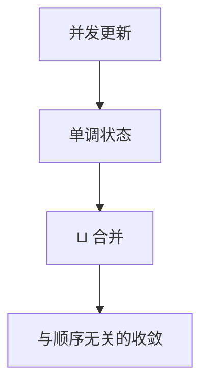

# CRDT

冲突无关：合并交换、结合、幂等，半格上的最小上界让并发写都不丢。代价是语义必须能写成这种代数。

<footer>—— 据 Shapiro, Preguiça, Baquero and Zawirski, Conflict-free Replicated Data Types, SSS 2011 整理</footer>

上一课[LWW](/cs/lww-conflict)用假全序丢一边。缺口是**不丢的合并**：并发加一、并发往集合里加元素，结果应都在。本课钉 CRDT 的半格条件，不重写向量检出。后课会话保证是客户端视角，不是合并代数。

## 问题

状态 CRDT：每个副本状态在半格里，收到他方状态就取 $\sqcup$。$\sqcup$ 交换、结合、幂等 ⇒ 任意传播顺序收敛到同一上界。操作 CRDT：广播操作，补偿关系让乱序应用等价。缺口：不是任何业务都能找 $\sqcup$。计数器可以；「唯一主键约束」很难；「转账不透支」通常要共识。

G-Counter、PN-Counter、G-Set、OR-Set、LWW-Register（寄存器仍是 LWW，只是嵌在半格里）是目录。RGA、WOOT 一类序列 CRDT 给协作编辑，本课点名不写变换细节。

SSS 2011 技术报告把 CvRDT 与 CmRDT 对齐。先前 Bayou 的提交是应用合并，不保证半格。

## 方法

设计：先写并发意图的交换图，再找单调状态。tombstone 让删除也单调（OR-Set）。压缩 tombstone 需要因果稳定——又用到[向量](/cs/vector-clocks)或 GC 纪元。传播仍用反熵或广播，CRDT 不替代[Dynamo](/cs/dynamo-anti-entropy)的运输层。

不要把「JSON 随便 merge」叫 CRDT。也不要把多主数据库默认当半格。

## 机制

G-Counter：每副本只增自己的分量，合并取 max，求和。两个 +1 来自不同副本则和为 2，LWW 做不到。OR-Set：添加带唯一标签，删除记标签；合并并上标签集。唯一约束「键只出现一次」与并发添加冲突，半格给不出「选一个不丢另一个」的业务含义——那就要 LWW 或共识。

元数据膨胀是工程税：标签、向量、墓碑。不膨胀往往牺牲精确并发（又滑回 LWW）。正确性相对代数，不相对 NTP。

本课不把区块链账本当 CRDT：全局唯一花费是共识对象。也不写 Transformer 或权重量化。

## 边界

本课不证所有目录结构的完备性，不写 delta-CRDT 全文。后课默认：能半格化的对象用 CRDT 换无协调合并；不变式跨对象（不透支）仍要[复制状态机](/cs/replicated-state-machine)或事务。会话保证下一课处理「我刚写的我看见」，那是客户端，不是 $\sqcup$。

代数对了，乱序与重复投递就不再是冲突源。代数不对，协议再精也在藏 LWW。

## 小结

- CRDT：合并是半格上界，并发更新可都不丢。
- 不是所有不变量都能半格化。
- 运输层仍要反熵；墓碑要因果 GC。
- 出处：Shapiro et al., SSS 2011。
