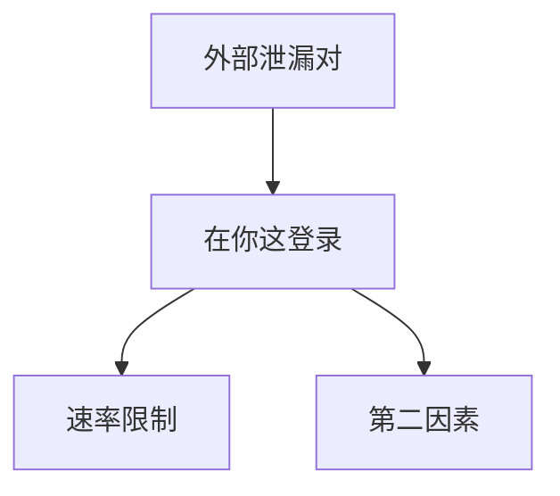

# 撞库与速率限制

别处泄漏的口令会被拿到你这再试。速率限制、多因素、泄漏口令检测降低自动化成功率；复杂密码规则挡不住已泄漏的那条。

<footer>—— 据 OWASP Credential Stuffing；NIST SP 800-63B；对照[密码破解](/cs/password-cracking)</footer>

## 定位

上一课[业务逻辑](/cs/business-logic-flaws)是工作流。缺口是**认证入口被自动化**。离线破解是哈希；本课是在线。不给撞库操作指导。

后课默认已经读完本课钉下的合同，只补差，不从该领域第一性原理重开。

## 问题

用户复用口令。攻击者持泄漏对。缺口：速率限制要按账户与地址分层、锁定策略防 DoS、MFA、已知泄漏口令检查。

### 验证码不是根

可被农场绕过。作辅助信号。

OWASP。禁止撞库教程。WAF 下一课是另一层过滤。

## 方法

分层限流、谨慎的设备信号、无口令或 WebAuthn。下一课 WAF。

图中节点是本课的机制骨架；课程不把图展开成可运行的攻击步骤。

## 机制

在线模型受接口约束，故限流有效；对已泄漏高价值账户仍要 MFA。WAF 下一课挡一部分自动化与注入噪声。

前提写进合同之后，游戏外的误用只当失败模式点名，不在本课写成操作程序。

## 边界

不写工具用法。WAF 下一课。

## 小结

- 逻辑洞之后，认证口仍会被泄漏口令打。
- 限流、MFA、禁已知泄漏。
- 在线不等于离线哈希破解。
- 下一课 WAF。
- 出处：OWASP Credential Stuffing；NIST SP 800-63B。
