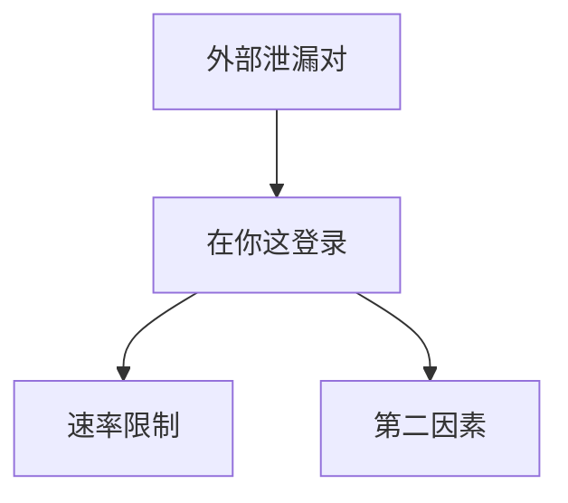

# 撞库与速率限制

别处泄漏的口令会被拿到你这再试。速率限制、多因素、泄漏口令检测降低自动化成功率；复杂密码规则挡不住已泄漏的那条。

<footer>—— 据 OWASP Credential Stuffing；NIST SP 800-63B；对照[密码破解](/cs/password-cracking)</footer>

## 定位

上一课[业务逻辑](/cs/business-logic-flaws)是工作流。缺口是**认证入口被自动化**。离线破解是哈希；本课是在线。不给撞库操作指导。

后课默认已经读完本课钉下的合同，只补差，不从该领域第一性原理重开。

## 问题

用户复用口令：泄漏语料里同一口令跨站点复现率很高，攻击者持的不是猜测而是正确答案的副本。离线要对付哈希与盐（回[密码破解](/cs/password-cracking)），在线撞库只要极低的单次成功率即有收益；源地址用住宅代理与僵尸网络分摊，纯按 IP 限流天然失效。缺口：速率限制要按账户与地址分层、锁定策略防 DoS、MFA、已知泄漏口令检查。

### 验证码不是根

可被农场绕过——人工打码按条计价，把验证码折成单价问题。它只抬高单位成本，作辅助信号，不当边界。登录速度、设备指纹、口令命中泄漏语料的比例才是可用信号。

OWASP。禁止撞库教程。WAF 下一课是另一层过滤。泄漏口令检查可走 k-匿名式查询：客户端只发 SHA-1 前 5 位 hex，对照 [k-匿名](/cs/k-anonymity)。

## 方法

分层：按账户、按 IP、按 ASN 三档阈值，账户档用滚动失败计数，命中后升难度（退避、CAPTCHA、二次验证）而非硬锁——硬锁是攻击者手里的 DoS 工具。注册与改密时拒收已知泄漏口令。MFA 用 [TOTP](/cs/totp-mfa) 或 [WebAuthn](/cs/webauthn-fido2) 抗重放，SMS 弱于 SIM 交换；无口令直接删掉可重放的共享秘密。NIST 800-63B 把节流定成义务，量级示例是按账户日百次失败。下一课 WAF。

```mermaid
flowchart TD
  LEAK["外部泄漏对"] --> TRY["在你这登录"]
  TRY --> RL["速率限制"]
  TRY --> MFA["第二因素"]
```

图中节点是本课的机制骨架；课程不把图展开成可运行的攻击步骤。

## 机制

在线模型受接口约束，故限流有效：每次尝试暴露在网络上，可被计数、延迟、拒绝；离线破解没有这个反馈通道，这是两课的分界。限流的经济性：撞库单价低、总量大，把单次成本抬高一个数量级就打穿期望收益。失败模式：阈值过紧锁出共享出口（校园、CGNAT）的正常用户；信号库有隐私与误报成本；对已泄漏的高价值账户，限流挡不住针对性人工登录，仍要 MFA。WAF 下一课挡一部分自动化与注入噪声。

前提写进合同之后，游戏外的误用只当失败模式点名，不在本课写成操作程序。

## 边界

不写工具用法。阈值按业务流量定，不是常数。WAF 下一课。

## 小结

- 逻辑洞之后，认证口仍会被泄漏口令打。
- 限流、MFA、禁已知泄漏。
- 在线不等于离线哈希破解。
- 下一课 WAF。
- 出处：OWASP Credential Stuffing；NIST SP 800-63B。
