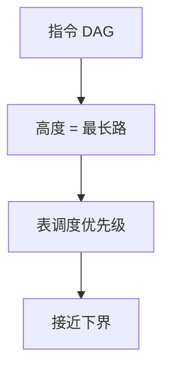

# 关键路径调度

DAG 上最长加权路径决定块的下界周期。优先级让关键路径上的节点先发，避免闲置把下界再拉长。

<footer>—— 据 Hu 的表调度传统；Hennessy and Gross；龙书指令调度；组成课[关键路径](/cs/critical-path) 对照整理</footer>

上一课[软件流水](/cs/software-pipelining)用 RecMII（环上关键）。块内同样：无环 DAG 的关键路径长度是表调度的下界。缺口是把组成课门级关键路径的直觉**搬到指令 DAG**（延迟为边权）。本课钉高度函数与为何「先发关键」，不写时钟树。

## 问题

就绪表若总发短延迟、非关键指令，关键节点被挤到后面，总拍数超过下界。优先级：节点高度 = 到出口的最长路径。缺口是**这个下界与启发式**，不是模 II。

寄存器压力：全按高度可能瞬时活太多，需混合优先级。

### 指令关键路径不是 STA 的门延迟

STA 是芯片；这里边权是指令延迟表（ISA/微架构模型）。模型错则调度错，不是硅上时序违例。

经典 list scheduling 用 height/latency。组成课 critical-path 是电路。本课明确不重画时钟树。

## 方法

从 DAG 汇点反向最长路。就绪时选高度最大。打破平局：延迟大、或扇出大。与资源（单端口乘）结合：资源可用才就绪。

与软件流水：RecMII 就是环上关键路径 / 迭代。同一度量，拓扑有环。

## 机制

下界不可达：资源冲突。启发式无保证。不要把关键路径当「必须连续发射」，中间可插独立指令填槽——那正是表调度的工作。

PGO：热块更值得按精确延迟模型排。

## 边界

本课不写电路 STA。后课默认：高度驱动表调度。下一课树匹配指令选择：调度前还要先选对指令。

也不把关键路径当项目管理。

## 小结

- 块内下界 = DAG 关键路径；高度优先逼近它。
- 资源约束使下界不可达。
- 与模调度的 RecMII 同源。
- 出处：Hennessy and Gross；龙书；对照组成课关键路径（不同对象）。
