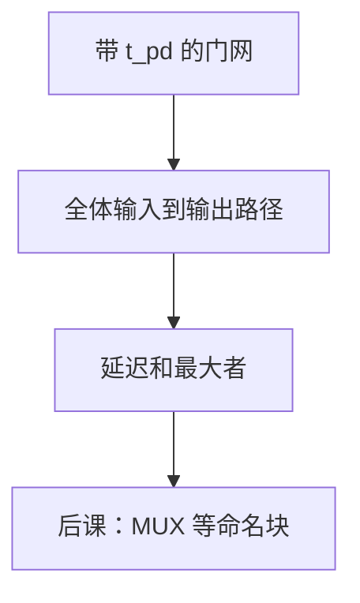

# 关键路径

电路的传播延迟不是「平均看起来多久」，而是输入到输出所有拓扑路径里最慢的那一条。

<footer>—— 据 Harris and Harris, Digital Design and Computer Architecture；Patterson and Hennessy, Computer Organization and Design (RISC-V) 整理</footer>

上一课[组合逻辑时延](/cs/gate-delay)给每个门贴了 $t_{pd}$ 与 $t_{cd}$。本课不重定义这两个量，也不从静态时序工具的 SDC 另起。缺口是：网表有许多输入-输出路径，后课周期、加法器选型、ALU 深度，要比的是**那一条最坏和**，不是某一条典型路径。

## 问题

单位延迟模型下，路径延迟是沿途门 $t_{pd}$ 之和。电路 $t_{pd}$ 取最大；那条路径叫关键路径。缺口因此不是新的门，而是：优化必须动这条路径——缩短非关键路径不提高时钟。假路径（功能上走不到的组合）可以标掉，本课承认存在，不把例外表写完。

后课[MUX](/cs/mux-select)、CLA、单周期 `lw`，都先找出哪一段串联最长。

### 关键路径不是「门最多的那条」

扇入、扇出、线负载改写每级延迟。门数少但每级很重，可以比门数多的浅路径更慢。把「级数」与「延迟」当成同一数字，超前进位的分组理由会说不清。

Harris 用路径延迟比较实现。Patterson/Hennessy 把 CPU 周期钉在最长指令的组合路径上。本课仍无时钟：关键路径是组合云的直径。

## 方法

从每个输入到每个输出做加权最长路（门延迟为边权）。输出再作为下一块输入时，把块当作超节点，块间再比。污染路径取最短，给后课保持时间用，不是本课的「关键」。

## 机制

行波加法的关键路径沿进位链，故 $t_{pd}=\Theta(n)$。CLA 把这条链拆成 $g,p$ 树，关键路径改走树高。后课单周期把「取指 + 译码 + ALU + 访存 + 写回 MUX」串成一条更长的关键路径；流水线再把它切开。本课只给「找最长」这一格。

## 边界

本课不跑 STA 工具、不建 RC 抽取。不把异步环振的周期当关键路径——那不是同步约束。多周期路径（有意两拍才采样）后课才出现。

后课默认：比较两个组合实现，先比关键路径；后课数据通路的周期下界来自这条路径加建立时间。

## 小结

- 关键路径是最坏 $t_{pd}$ 之和，决定组合块有多慢。
- 优化非关键路径不提高时钟。
- 门数与延迟不是同一尺子。
- 出处：Harris and Harris；Patterson and Hennessy, COD (RISC-V)。
