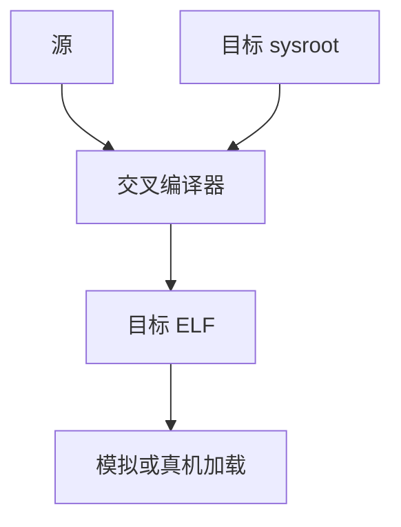

# 交叉编译与三元组

三元组写出 CPU–厂商–OS–ABI。交叉编译在主机上为另一三元组生成 ELF，系统根、头文件与库必须匹配目标，而不是主机。

<footer>—— 据 GNU Autoconf 三元组惯例；Clang `--target`；交叉工具链实践整理</footer>

上一课[ELF 加载](/cs/exec-loading-elf) 假定二进制已是本机 ABI。缺口是**为另一台机器生成**：`riscv64-unknown-linux-gnu`。后端与链接课序在此收束。下一单元运行时与 VM。本课钉 sysroot 与不要混链主机 libc。

## 问题

编译器默认主机三元组。交叉：`--target` 选[目标描述](/cs/target-description)，链接器选目标 `ld`、目标 `libc`。缺口是**工具链前缀与 sysroot**，不是内核 mmap。

`build/host/target` 三词：Autoconf 的 Canadian cross 点名。日常：host=本机，target=嵌入式。

### 三元组不是「ISA 别名」

`x86_64-linux-gnu` 与 `x86_64-linux-musl` 同一 ISA，libc/ABI 不同，不能混 `.so`。不要只看 `uname -m`。

GNU config.sub。Clang/LLVM 三元组。本课不写发行版如何打 rootfs。

## 方法

`--sysroot` 指向目标根。pkg-config 要目标的。QEMU user 可跑目标 ELF 做测试。表调度延迟模型应按目标微架构，不是主机。

与 LTO：主机跑 lto，目标后端代码生成——bitcode 是中立的，机器描述仍是目标的。

## 机制

错误：链接了 `/usr/lib` 主机库，加载时 SIGSEGV 或 ELF 类不匹配。检查：`file`、`readelf -h` 的机器字段。

多架构 Docker 不是本课重点；原理仍是三元组。

## 边界

本课不写发行构建系统。后课默认：后端输出服从三元组。下一课字节码解释器：另一类「目标」，不是 ELF 加载。

也不把三元组当 Transformer 的 tokenization。

## 小结

- 三元组标识 ISA+OS+ABI；交叉用匹配的 sysroot。
- 混链主机库是经典失败。
- LTO 在主机优化、在目标降码。
- 出处：GNU 三元组惯例；Clang `--target`；对照 ELF 加载。
