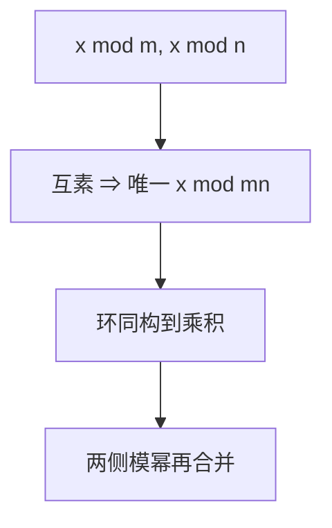

# 中国剩余定理

模两两互素时，同余方程组有唯一解模乘积；$\mathbb{Z}/mn\mathbb{Z}\cong\mathbb{Z}/m\mathbb{Z}\times\mathbb{Z}/n\mathbb{Z}$。RSA 的 $p,q$ 两侧运算由此合法。

<footer>—— 据《孙子算经》；Gauss；Ireland and Rosen 整理</footer>

上一课[欧拉定理](/cs/fermat-euler) 在单个模上减指数。缺口是**联立**：已知 $x\bmod p$、$x\bmod q$，恢复 $x\bmod pq$。CRT。构造：$x=\sum a_i M_i y_i$，$M_i=M/n_i$，$y_i=M_i^{-1}\bmod n_i$。本课互素情形；一般模用 gcd 条件。

## 问题

环同构：一对 $(x\bmod m,x\bmod n)$ 对应唯一 $x\bmod mn$。乘法、加法分量做。RSA 解密可在模 $p$ 与模 $q$ 上做模幂再合并，快约四倍（指数更短）。证明 $a^{k\lambda(n)}\equiv a\pmod{pq}$ 也对非互素 $a$ 成立时，走两边再 CRT。

非互素：方程组可能无解。本课主线两两互素。

### 不是「哈希到小整数」

CRT 是同构，信息不少。把消息拆成模 $p$ 与模 $q$ 仍保密——因为 $p,q$ 是私钥。公开 $n$ 上不能拆。

《孙子算经》物不知数。Gauss 《算术探究》。Knuth 卷 2。密码实现的 Garner 算法是 CRT 的一种组织，点名。

## 方法

解 $x\equiv 2\pmod 3$、$x\equiv 3\pmod 5$、$x\equiv 2\pmod 7$。写出同构对乘法：模 $15$ 的零因子对应一侧为 $0$。指出：求 $\varphi(pq)$ 需要 $p,q$，与 CRT 拆运算是同一秘密的两面。

## 机制

有了同构，下一课才能安心谈「先当环、再当域」：模素数是域，模 $pq$ 只是环。CRT 把环拆成域的积。后课有限域 $\mathrm{GF}(2^n)$ 是另一构造，不是 CRT。

Coppersmith、Hastad 广播攻击用 CRT 组合同一指数的密文，本课不进攻击细节。

一般形式：模 $n_i$ 不必互素，当 $a_i\equiv a_j\pmod{\gcd(n_i,n_j)}$ 才有解，解模 $\mathrm{lcm}$。Garner 算法按前缀逐步合并，实现常用。RSA-CRT 私钥含 $d_p,d_q$；侧信道若漏出一侧余数会危及分解，属实现，本课只给同构。

## 边界

本课不证环论的一般中国剩余，不引入赋值。不写 RSA 实现代码。后课默认：互素模系可拆可合。下一课群环域的名字。

同构把「一组小模余数」与「一个大模余数」当成同一元素的两种写法。RSA 用它加速；安全上 $p,q$ 仍须保密。非互素方程组可能无解，主线用两两互素。

上一课留下的缺口在本课收口；「中国剩余定理」进入后课词汇表后只引用。文献用来钉对象与边界，不把本课写成该主题的独立综述。

## 小结

- 两两互素：方程组唯一解模乘积；环同构到乘积环。
- RSA 用它把模 $n$ 运算拆到 $p,q$。
- 非互素则可能无解。
- 出处：《孙子算经》；Gauss；Ireland and Rosen。
