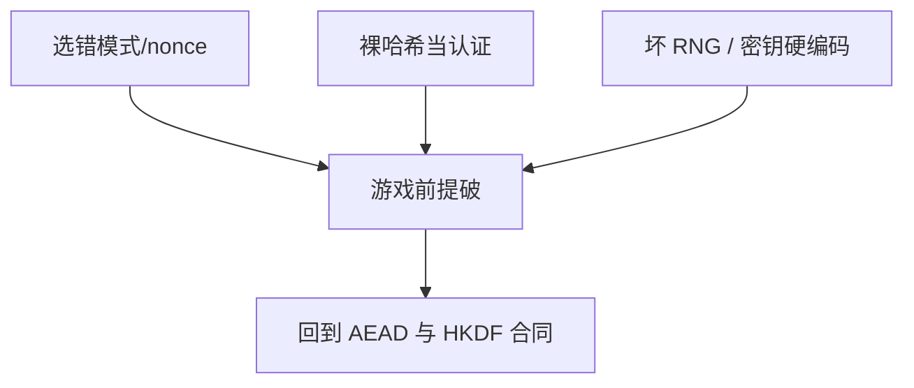

# 密码学误用清单

破掉产品的常常不是新的密码分析，而是 ECB、nonce 复用、裸哈希当 MAC、自制 RNG、把身份写进 JWT 却不验签。清单用来对照合同，不是利用手册。

<footer>—— 据 Anderson, *Security Engineering*；Egele et al. 对 Android 密码学误用的测量；对照 NIST 与 RFC 的合同条款</footer>

## 定位

上一课[归约](/cs/provable-security-reduction)说明证明有前提。缺口是把本单元散见的失败收成**检查单**，作为密码学进阶的封口，并交给下一单元「证书链到底验什么」。

后课默认已经读完本课钉下的合同，只补差，不从该领域第一性原理重开。

## 问题

工程上重复出现：ECB 或未认证加密、静态 IV、CBC+可区分填充错误、$H(k\|m)$、MD5 当签名哈希、RSA 无填充、ECDSA 坏 $k$、硬编码密钥、自签还关校验。缺口是清单与「每条对应哪一课合同」，不是新算法。

### 库默认值也是合同

有的 API 默认 ECB 或允许 `None` 算法。选库等于选游戏前提。

Anderson 反复强调实现与流程。学术测量（如 CryptoLint 一类）表明误用普遍。本课不提供扫描目标站点的操作指南。

## 方法

按原语课序对照列出「正确形状」。要求：AEAD、唯一 nonce、HMAC/HKDF、OAEP/PSS、CSPRNG、密钥分离、常数时间比较。指出下一单元从 PKI 验证细节开始，因为「有证书」仍可能什么都没验。

图中节点是本课的机制骨架；课程不把图展开成可运行的攻击步骤。

## 机制

误用把可证明对象变回「有加密外观」。审查应问合同而非算法名。协议与身份单元将看到：TLS 配置、JWT `alg`、OAuth 重定向，是同一类失败在协议层的投影。

前提写进合同之后，游戏外的误用只当失败模式点名，不在本课写成操作程序。

## 边界

本课不把清单写成攻击脚本。下一课程单元「协议与身份」第一课：证书链验证细节——主干 PKI 课之后仍被跳过的那些检查。

## 小结

- 归约在合同内；本课列合同外高频失败。
- AEAD、nonce、HMAC、填充、RNG、密钥分离。
- 库默认与「有加密」不是证明。
- 下一单元：证书链验证细节。
- 出处：Anderson, *Security Engineering*；Egele et al.；NIST SP 800-38 系列与 RFC 8446。
