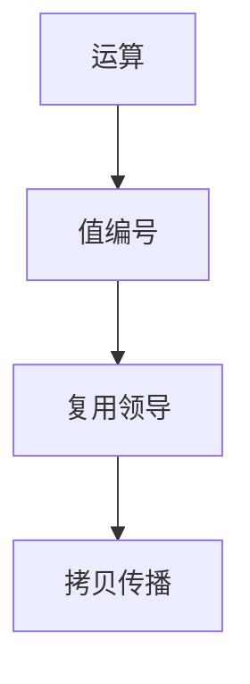

# CSE 与 GVN

公共子表达式：同一运算算两次则复用。全局值编号给每个值一个类，按哈希把等价计算并成一个领导。

<footer>—— 据 Cocke, Global Common Subexpression Elimination；Alpern, Wegman and Zadeck, Detecting Equality of Variables in Programs, 1988；Click, Global Value Numbering 整理</footer>

上一课[SCCP](/cs/sccp)处理常量这一格。缺口是**结构相等**：`a+b` 在两处出现，或经代数 `a+b` 与 `b+a`（若交换）。CSE 是数据流「可用表达式」的消除；GVN 用编号。主干[可用表达式](/cs/available-expr)已给方程。本课钉 SSA 上的实践，不重推位向量。

## 问题

可用表达式：程序点上「若再算 $a+b$ 则与先前同一」。局部 CSE 在基本块哈希表即可。全局：须支配——复用点被计算点支配，否则要插入或放弃。GVN：值编号，φ 与运算的合同。缺口是**何时可删第二次运算**，不是常量格。

Click 的 GVN 可与 SCCP 类似地乐观。代数化简（`x-x`）属同一遍或相邻遍。

### 编号不是「名字字符串」

`add x1, y1` 与 `add x2, y2` 仅当 $x$、$y$ 编号相同才同号。SSA 使「同名」等价于「同值」对标量成立；内存不算，除非别名说只读。

Cocke 早期 CSE。AWZ 1988。Click 的 GVN。龙书 6.1.2 / 9.1。Appel 有局部值编号。

## 方法

局部：块内表，键为操作码+操作数编号。全局：RPO 遍历支配树，或 AWZ 的哈希。消除：第二次改成对领导的拷贝，再拷贝传播。

与 LICM：循环里不变的公共表达式先外提再编号，后课。不要对可能陷阱的运算（除零、load）在不可靠路径上复用——控制依赖。

## 机制

交换律：规范化操作数序（编号较小者在前）再哈希。浮点：交换律在 IEEE 下对 NaN/符号有坑，fast-math 才开。

PRE（部分冗余）后课：表达式在部分路径可用时插入使全局可用。

## 边界

本课不写别名。后课默认：标量纯运算可 GVN。下一课 DCE/ADCE：编号后的死拷贝与死块。

也不把 CSE 当加密哈希碰撞问题；编号哈希冲突只影响编译期表。

## 小结

- CSE：复用已算的表达式；GVN 用值编号找等价。
- 支配决定全局复用点。
- 内存与浮点要额外纪律。
- 出处：Cocke；Alpern–Wegman–Zadeck, 1988；Click；龙书。
