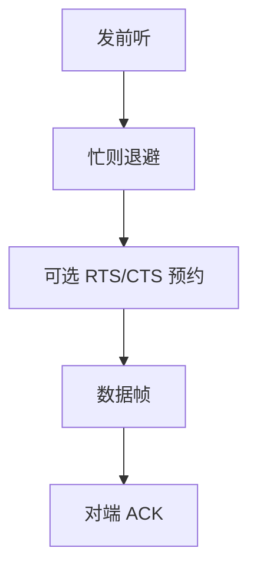

# CSMA/CA 无线对照

无线往往不能边发边听自己的冲突；改成发前避让，并用预约把隐藏终端的碰撞推开。

<footer>—— 据 IEEE 802.11；Kurose and Ross 对 CSMA/CA 与隐藏终端的整理</footer>

[上一课](/cs/csma-switch)在有线共享介质上用 CSMA/CD，又用交换机把冲突域收到端口。本课不重讲 MAC 学习。缺口是无线：同一信道上仍要多址，但发送机自己的信号淹没接收，**冲突检测（CD）做不成**。对照是 CSMA/CA：避让代替边听。

## 问题

有线 CD 假设：发送时仍能从介质上听出别人的能量。无线收发隔离困难，而且「我听不见你」不等于「目的听不见你」——隐藏终端。若仍按以太网那样抢完再靠 FCS 发现，碰撞浪费整帧空气时间。缺口是访问方法换成**冲突避免**，不是新的 IP。

隐藏终端：A 与 C 都听不见对方，却都能让 B 处碰撞。暴露终端是对偶：听见别人并不等于自己发送会破坏那次接收。

## 方法

CSMA/CA：发前听信道；忙则随机退避。可选 RTS/CTS：短控制帧让周围节点设置 NAV，在一段时间内不发，把信道当预约。确认仍常要显式 ACK，因为单向听到的「能量」不等于对端收对。本课不把 802.11 全部帧类型与速率自适应写成标准正文。

## 机制

CA 把碰撞从「发到一半发现」改成「尽量别同时发」。交换机那一套学源 MAC、缩小冲突域，在无线接入点上变成基础结构模式：站点经 AP 转发，但空口仍是共享介质。FCS（[上一课的 CRC](/cs/frame-crc)）照旧丢坏帧；避让只降低碰撞概率。端到端可靠性仍不在这一层。

## 边界

本课不引入蜂窝调度与 TDMA 主干，不把蓝牙跳频当 802.11。全双工有线交换口上已经不用 CA；不要把无线退避抄回数据中心以太网当默认。生成树处理的是有线环路，下一课，不是隐藏终端。

后课默认：共享空气用避让与预约。有线交换网里广播域仍可能环，下一课生成树。

## 小结

- 无线难做 CD，CSMA/CA 用听、退避与可选预约。
- 隐藏终端是几何问题，不是 CRC 多项式选错。
- 有线环路是另一缺口，下一课生成树。
- 出处：IEEE 802.11；Kurose and Ross。
