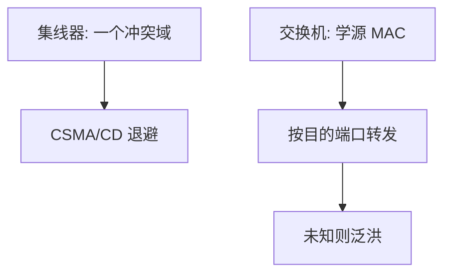

# CSMA 与交换

载波监听多路访问在发送前听介质；交换式以太网把冲突域缩小到链路，用转发表按 MAC 转发。

<footer>—— 据 Metcalfe and Boggs, 1976；Kurose and Ross 对 CSMA/CD 与交换的整理</footer>

[上一课](/cs/frame-crc)给出帧与 MAC。共享同轴或集线器上，两台同时发会破坏信号。缺口是介质访问：**CSMA/CD**；以及当代默认：**交换机**学习 MAC、转发帧，冲突域不再是整个局域网。本课不把生成树环路写完。

## 问题

纯 ALOHA 冲突浪费大。CSMA：发前听；CD：边发边听，冲突则发拥塞信号并二进制退避。交换：每端口独立缓冲，根据目的 MAC 只从对应端口送出；未知则泛洪。缺口不是新的帧格式，而是从「大家抢一根线」到「按地址点到点转发」。

全双工交换链路上不再用 CD，CSMA 作为共享介质与半双工的历史机制保留在对照里。

冲突域：一处冲突大家都能检测到的范围。广播域：广播帧能到达的范围。交换机分割冲突域，默认不分割广播域。

## 方法

集线器：电气中继，一个冲突域。交换机：收完整帧（或直通），查 MAC 表，命中则单端口发送，表项由源 MAC 学习、老化删除。未知目的、广播、组播：向除入端口外泛洪。本课假定无环拓扑；有环则泛洪放大，下一课生成树。

## 机制

交换把链路层做成小规模的「路由」，但键是 MAC 不是前缀。DMA 进来的帧在交换机里可能再 DMA 出去，主机 OS 看不见。端到端仍不在这一层完成：交换机可以丢帧，FCS 只到下一跳。与 IP 的分工：同一广播域内靠 MAC 到主机，跨网要后课 IP。

学习表会错（主机挪端口）靠老化；恶意灌表留给安全课。

## 边界

本课不引入数据中心的 TRILL/SPB 作为主干，不把流量控制 PAUSE 帧写完。也不把无线 CSMA/CA 的全部 NAV 机制展开，只承认无线不能「边发边听」故用 CA。环路与广播风暴，下一课。

直通交换降低延迟，但可能转发 FCS 错误的帧；存储转发等整帧校验完再送。教学默认存储转发。

交换机缓冲占满时仍会丢帧，CSMA 的退避救不了全双工口上的拥塞。

后课默认：交换按 MAC 转发，未知泛洪。有冗余链路时必须先成树，下一课生成树。

## 小结

- CSMA/CD 解决共享介质冲突；交换缩小冲突域。
- 交换机学源、转目的、未知泛洪。
- 环路需要生成树。
- 出处：Metcalfe and Boggs；Kurose and Ross；IEEE 802.3。
