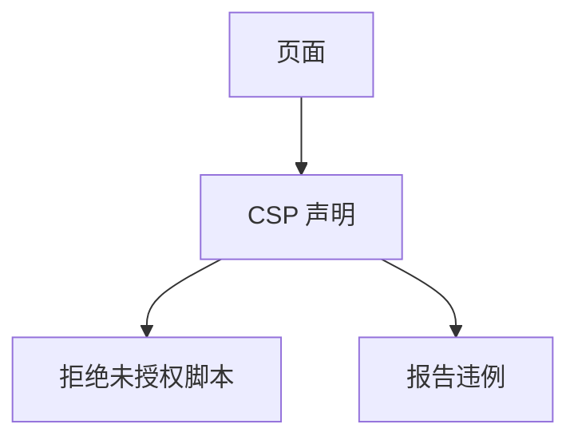

# CSP

内容安全策略用声明限制页面能加载和执行的脚本、框架与连接。它把「不小心拼进页面的字符串」从默认可执行改成默认拒绝，是 XSS 的纵深，不是许可再拼接。

<footer>—— W3C CSP；Stamm, Sterne and Markham；对照 MDN 对指令的整理</footer>

## 定位

上一课[XSS](/cs/xss)要求编码。缺口是**即使漏了一处**，浏览器策略仍可挡住内联脚本。本课讲 CSP 指令，不写如何绕过 CSP 的清单。

后课默认已经读完本课钉下的合同，只补差，不从该领域第一性原理重开。

## 问题

默认允许内联与 eval 时 XSS 面大。script-src 用 nonce 或 hash 放行自己的脚本。缺口是策略与报告（report-only）的部署。

### nonce 要随机

固定 nonce 等于没策略。每响应须用 CSPRNG。

CSP Level 3。unsafe-inline 几乎撤销脚本保护。本课禁止绕过教程。

## 方法

列关键指令：script-src、default-src、frame-ancestors、connect-src。对照 CORS 下一课：CSP 管本页能拉什么，CORS 管外源能不能读响应。

图中节点是本课的机制骨架；课程不把图展开成可运行的攻击步骤。

## 机制

纵深：编码失败时策略仍挡一类执行。它不挡无脚本的 HTML 注入外观。CORS 下一课是读响应的另一扇门。

前提写进合同之后，游戏外的误用只当失败模式点名，不在本课写成操作程序。

## 边界

不写绕过。CORS 下一课。

## 小结

- XSS 根治是编码；CSP 是浏览器默认拒绝。
- nonce/hash 放行自己的脚本。
- unsafe-inline 撤防。
- 下一课 CORS。
- 出处：W3C CSP；Stamm, Sterne and Markham。
