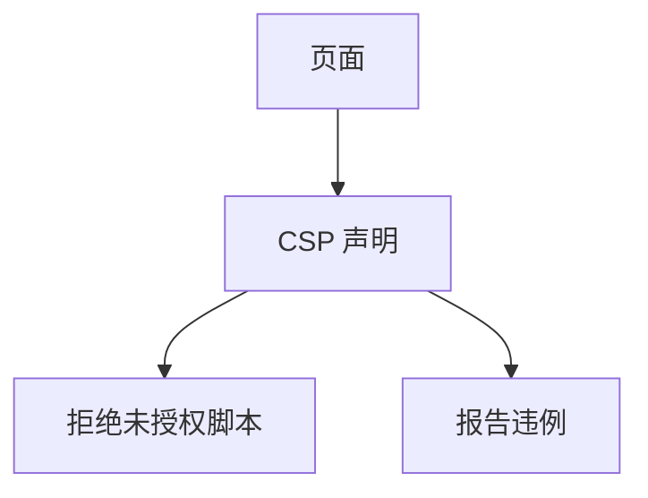

# CSP

内容安全策略用声明限制页面能加载和执行的脚本、框架与连接。它把「不小心拼进页面的字符串」从默认可执行改成默认拒绝，是 XSS 的纵深，不是许可再拼接。

<footer>—— W3C CSP；Stamm, Sterne and Markham；对照 MDN 对指令的整理</footer>

上一课[XSS](/cs/xss)的根治是输出编码，但编码要求每处拼接都做对。缺口是**即使漏了一处**，浏览器策略仍能挡住内联脚本的执行。本课讲 CSP 指令，不写绕过清单。

后课默认已经读完本课钉下的合同，只补差，不从该领域第一性原理重开。

## 问题

浏览器默认允许内联脚本与 eval，XSS 一次注入即可执行。CSP 把默认翻成拒绝：script-src 用每响应随机的 nonce 或脚本内容 hash 放行自己的一等脚本，其余一律不跑。缺口是部署——策略怎么写，report-only 模式怎么先观测违例再收紧。

### nonce 要随机

nonce 必须随机：固定 nonce 等于没策略，注入脚本只要读一次页面就拿到通行证；每个响应用 CSPRNG 现生成。

CSP Level 3。unsafe-inline 几乎撤销脚本保护。本课禁止绕过教程。

## 方法

方法先列关键指令：script-src 管脚本，default-src 给其余资源兜底，frame-ancestors 管本页能被谁嵌框，connect-src 管脚本能往哪发请求。对照下一课 CORS：CSP 管本页能拉什么，CORS 管外源能不能读响应，两扇门方向相反。

```mermaid
flowchart TD
  PAGE["页面"] --> POL["CSP 声明"]
  POL --> DENY["拒绝未授权脚本"]
  POL --> RPT["报告违例"]
```

## 机制

机制是纵深：编码漏掉的那一处，注入的 `<script>` 因缺 nonce 被浏览器拒绝执行——错误被限制在「注入了死文本」而非「代码执行」。它不挡无脚本的 HTML 注入：假表单、外观篡改这类钓鱼仍在。一旦写进 unsafe-inline，脚本保护几乎整体撤销。CORS 下一课是读响应的另一扇门。

## 边界

不写绕过；边界要点名：策略的安全性按最松的一处计算——任何宽域名通配或放行 data: URL 都拉低整体。CORS 下一课。

## 小结

- XSS 根治是编码；CSP 是浏览器默认拒绝。
- nonce/hash 放行自己的脚本。
- unsafe-inline 撤防。
- 下一课 CORS。
- 出处：W3C CSP；Stamm, Sterne and Markham。
