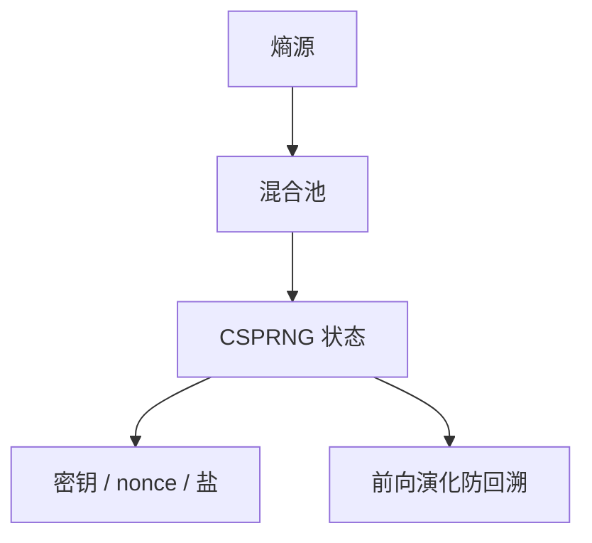

# CSPRNG

密码学伪随机不是 `rand()`：要前向保密式的状态演化、要抗回溯、熵源要估价。nonce、OAEP 种子、ECDSA 的 $k$、密钥本身，都从这里出来。

<footer>—— NIST SP 800-90A；对照 Ferguson, Schneier and Kohno 对生成器失败；Katz and Lindell 的 PRG 合同</footer>

## 定位

上一课[ECDSA / EdDSA](/cs/ecdsa-eddsa)把确定性签名当成对 RNG 失败的修复。缺口是**其余一切仍要生成器**：密钥、nonce、盐。PRG 课给了理论 $G(s)$；本课给操作系统与协议里的 CSPRNG 合同。

后课默认已经读完本课钉下的合同，只补差，不从该领域第一性原理重开。

## 问题

理论 PRG 假设种子均匀保密。实践：熵从中断、抖动、硬件指令来，估计不足会出弱密钥。生成器状态泄漏后，若不能前向安全演化，过去输出可被回溯。缺口是 CSPRNG 的再播种与预测抗性，不是再定义不可区分游戏。

### 不要用哈希时间戳当密钥

可预测输入不是熵。Debian OpenSSL 一类事故是种子空间塌缩——点名失败模式，不给复现。

SP 800-90A 的 Hash_DRBG / HMAC_DRBG / CTR_DRBG。Linux getrandom / 用户态 ChaCha。Fork 后要重种。本课不写如何削弱某生成器。

## 方法

分层：硬件熵 → 内核混合池 → 用户态 DRBG。列出消费者：密钥、nonce、盐、OAEP 种子。Ed25519 仍依赖 CSPRNG 生成私钥本身。

图中节点是本课的机制骨架；课程不把图展开成可运行的攻击步骤。

## 机制

计算安全处处假设「随机带」。CSPRNG 是这条带的工程实现。失败表现为可预测 nonce（回到误用课）或可预测 $k$（回到 ECDSA）。HKDF 下一课是从已有秘密派生，不是从熵池抽——二者分工。

前提写进合同之后，游戏外的误用只当失败模式点名，不在本课写成操作程序。

## 边界

本课不评估具体 CPU 指令的熵质量论文全文。下一课 HKDF：已有 IKM 时如何拉出多把键，而不是再去碰熵池。

## 小结

- 签名确定性不取消密钥生成对 CSPRNG 的需求。
- 要抗预测与回溯；熵估计失败是规格事故。
- `rand()` 与时间戳不是 CSPRNG。
- 下一课 HKDF：从已有秘密派生键。
- 出处：NIST SP 800-90A；Ferguson, Schneier and Kohno；对照 RFC 4086。
