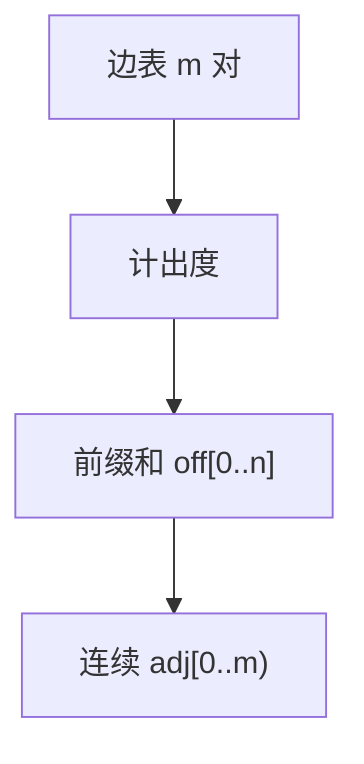

# 边表与 CSR

先把所有边摊成一条数组，再用 $n+1$ 个偏移标出每个顶点的一段；枚举邻居变成连续下标，没有指针。

<footer>—— 据 Cormen, Leiserson, Rivest and Stein 对邻接表的数组化；稀疏矩阵压缩行存储的同一布局 整理</footer>

[上一课](/cs/sparse-graph)把 $m\ll n^2$ 写成默认，并已经点名 CSR，却未把偏移数组与边表对照写完。[邻接表与邻接矩阵](/cs/adj-list-matrix)的表仍可以是指针链。本课不重讲稀疏假设。缺口是三种连续表示：边表（pair 数组）、CSR（偏移 + 邻接下标）、以及有向图入边的 CSC。DAG 课要用「建完再检环」的静态图；CSR 正是静态默认。

## 问题

指针邻接表每条边一次堆分配，局部性差，增边方便。算法主干常是：**先读完全部边，再跑 BFS**。缺口不是新的图定义，而是布局：边表 `E[0..m)` 存 `(u,v)` 或 `(u,v,w)`，建图 $O(m)$，枚举 $u$ 的出边要扫全部边除非排序。CSR：先计数每个出度，前缀和得到 `off[v]`，把邻居写入 `adj[off[v] .. off[v+1])`。枚举连续，$\Theta(\deg(v))$ 步且吃 cache。

静态：CSR 改一条边要重建或预留空洞。动态增边回到向量-of-vectors 或链表。

压缩稀疏行来自稀疏矩阵 $A$ 的行指针。无向图每条边在 `adj` 里出现两次，或边表存一次、CSR 建两份方向。

## 方法

建 CSR：一遍数度，`off[0]=0`，`off[i+1]=off[i]+deg[i]`，再一遍填 `adj`（可用 `off` 副本当写指针）。问边 $(u,v)$：在 $u$ 的段里扫或对该段排序后二分；需要 $O(1)$ 再另建散列。

CSC：按入边压缩，列偏移。需要入邻居时（拓扑 Kahn 的入度已另存）不必扫整张 CSR。

## 机制

空间 $\Theta(n+m)$ 与表相同，少指针开销。NUMA 上 `adj` 可按顶点区间切分。[局部性原理](/cs/locality-principle)：BFS 按 CSR 扫出边，块预取有对象；指针表没有。这不改变 $\Theta(n+m)$，改变常数——稀疏课已经预告。

平行边、自环：CSR 如实存放；算法自己决定是否跳过。加权：并行 `w[j]` 与 `adj[j]` 对齐。

## 边界

本课不引入图稀疏化、不写动态 CSR 的对数重建。平面图下一课是拓扑性质（$m=O(n)$ 的一类理由），不是另一种存储格式——平面图仍用 CSR。也不把矩阵 CSR 乘法写进主干。

后课默认：静态稀疏图用 CSR；边表当输入交换格式。无环有向是额外不变式，下一课 DAG。

## 小结

- 边表便于输入；CSR 用偏移把出边收成连续段。
- 静态、枚举友好；动态更新贵。
- DAG 的无环约束下一课加在同一表示上。
- 出处：Cormen et al. 邻接表；稀疏矩阵 CSR 的标准布局。
